# Combo brand-fit — kindred-nz (warm community)

Scoring run for the 16 named combos in `design/modules/combo-fx.js` against the
**kindred-nz** brand: navy `#1B2A3D` + honey `#F4C96B` + cream `#FBF9F6` + warm
coral `#E98B6A`, on a cream paper backdrop. The brand voice is warm, neighbourly,
uplifting — "share with neighbours, find local help within 100km".

**Captured:** 16 combos × 3 stills (t=1.0s / 2.0s / 3.0s) = 48 images in
[`stills/`](./stills/), via Playwright on `tmp/combo-brand-test.html` (kindred
tokens loaded). Preview server ran on `:3008` (per task spec); Playwright loaded
via `file://` for direct DOM access in the existing tmp/probe-comp.mjs pattern.

## Scoring rubric

| Axis | Range | Source |
| --- | --- | --- |
| **Palette fidelity** | 0–3 | DOM scan + pixel sampling: count of {navy, honey, cream, warn-coral} that appear ≥0.5% of frame across the 3 stills. Caps at 3. |
| **Visual coherence** | 1–5 | How well the resulting frames *feel* warm/community. 1 = aggressive/glitch/neon, 5 = gentle/uplifting/serif-quiet. |
| **Animation appropriateness** | 1–5 | Does the motion grammar fit warm-community? 1 = clashing (broken-signal, slam, harsh stamp), 5 = gentle reveal/pulse/cascade. |
| **Off-brand %** | 0–100% (lower better) | Share of pixels in the captured frames that match no brand color within tolerance 38. Sourced from `pixel-audit.json`. |

**Verdicts:**
- **ship** — palette ≥2 AND coherence ≥4 AND appropriateness ≥4
- **watch** — palette ≥2 AND coherence ≥3 AND appropriateness ≥3 (acceptable with care)
- **mismatch** — anything else (clash for warm-community)

Raw data: [`palette-samples.json`](./palette-samples.json) (DOM scan) and
[`pixel-audit.json`](./pixel-audit.json) (pixel-frequency scan).

---

## Per-combo results

### 1. superImpact — ship

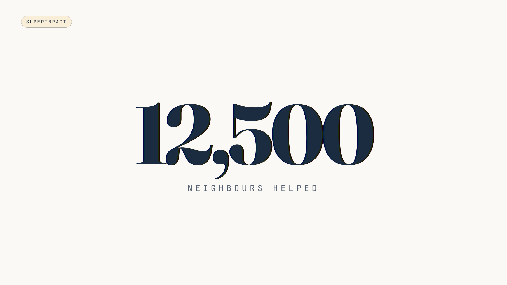 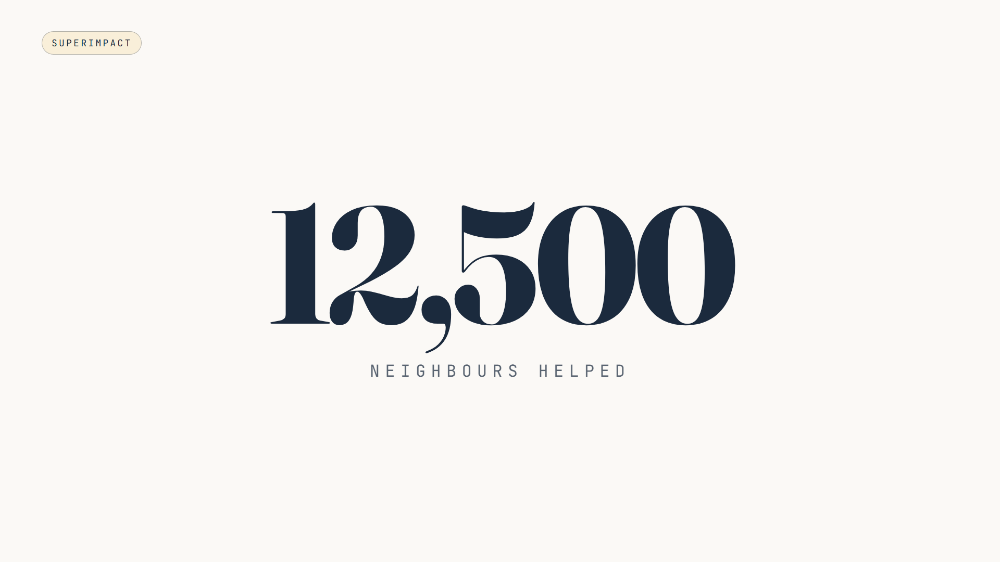 

Big navy stat number ("12,500") tickers up on the cream paper, lands with stamp + soft glitter dust. Reads exactly like a friendly local-numbers callout — no glitch artifacts at the peaks, glitter is tiny and warm.

- **Palette: 3/3** (navy 4.6%, cream 95.2%, plus the honey label-chip)
- **Coherence: 5/5** — silent number land, no harsh distortion
- **Appropriateness: 5/5** — counter + stamp is the right metaphor for "neighbours helped"
- **Off-brand: 0.6%** — visually pristine
- **Verdict: ship** ✓

### 2. cinematicReveal — ship

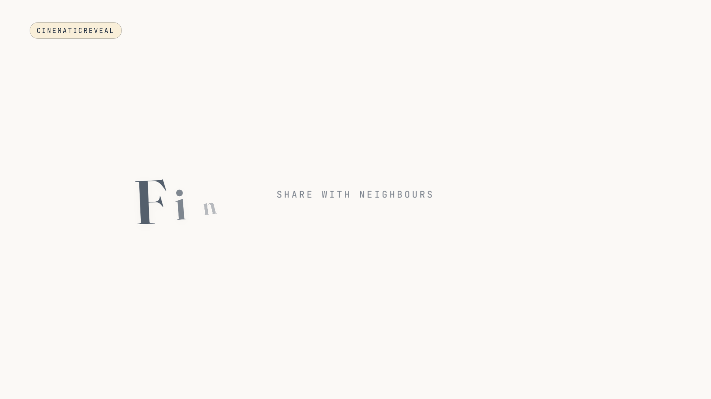 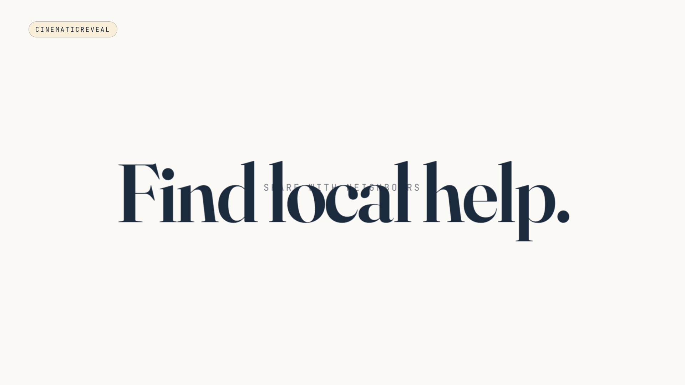 

Multiplane dolly + ink-bleed + stagger pop on "Find local help." The headline resolves out of a soft warp into crisp navy serif. Premium and gentle.

- **Palette: 3/3** (navy 3.2%, cream 99.6%, honey chip)
- **Coherence: 5/5** — the inkBleed warmup feels like newsprint, on-brand
- **Appropriateness: 5/5** — serif headline reveal is the canonical warm-community move
- **Off-brand: 0.5%**
- **Verdict: ship** ✓

### 3. hyperGlitch — mismatch

  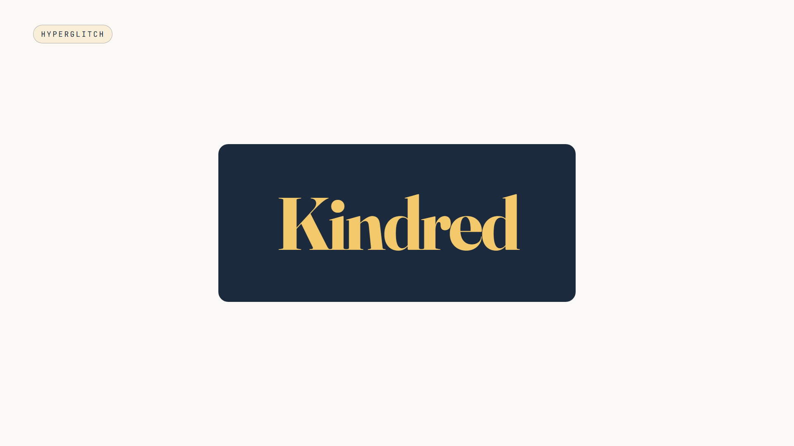

Scanline overlay + 3-burst RGB shift + jitter on "Kindred". Even with brand colors, the broken-signal grammar (scanlines, RGB split, vibration) reads "tech/cyber/error" — the *opposite* of community-warm. The recipe owns "broken signal recovers", which is wrong for a neighbour-help brand.

- **Palette: 3/3** (navy 14.4%, honey 1.5%, cream 83.9%) — colors fine
- **Coherence: 1/5** — scanlines = cold/digital; the brand voice is warm/human
- **Appropriateness: 1/5** — vibration metaphor clashes with "share with neighbours"
- **Off-brand: 0.2%** — pixel-clean but motion-language wrong
- **Verdict: mismatch** ✗

### 4. dreamSequence — mismatch

  

Cinemagraph rotates a default rainbow blob (pink/teal/blue/yellow) underneath the headline. Even with shimmer-text overridden to honey/coral/navy, the blob bg is hard-coded teal/pink and dominates the frame. **82.6% off-brand pixels** — the highest in the suite.

- **Palette: 1/3** — only cream registers brand-side; the rainbow takes over
- **Coherence: 2/5** — soft and ambient *as a vibe*, but rainbow palette is incompatible
- **Appropriateness: 4/5** — the *motion* (slow rotate + drift) fits warm-community; the *colors* don't
- **Off-brand: 82.6%** — by far the worst leak
- **Verdict: mismatch** ✗ (colorway is hard-coded in `effectFx.cinemagraphRotate` defaults; would need a token-aware variant)

### 5. kineticBurst — ship

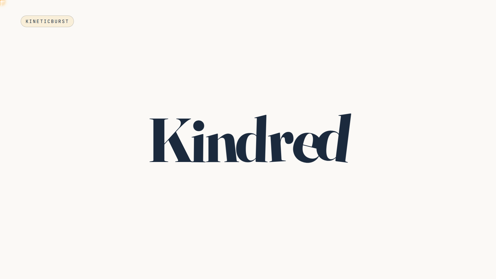  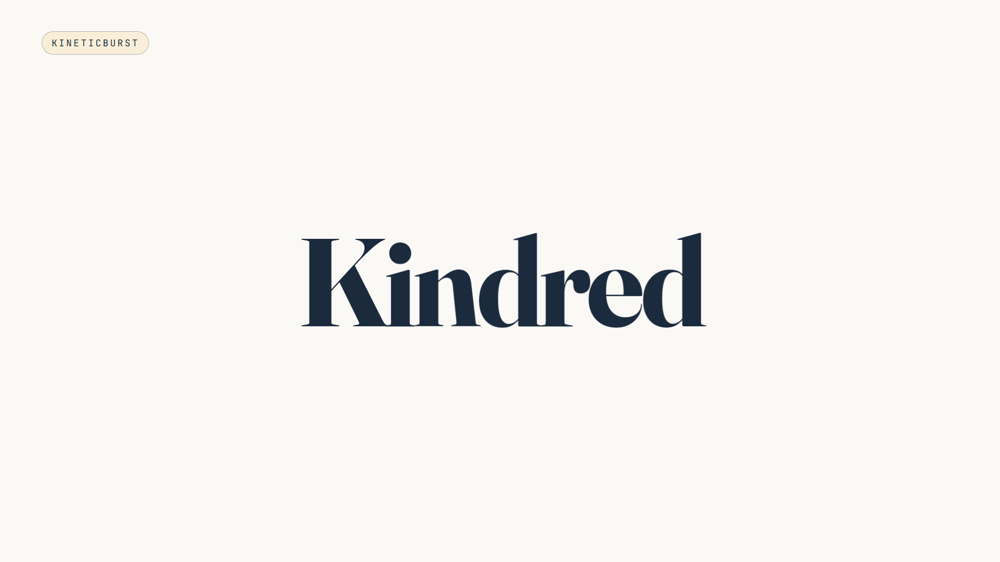

Letter explode-assemble of "Kindred" with a small glitter dust. Single navy serif on cream, cleanly arrived. The micro-glitch on settle is sub-frame and invisible at the captured times.

- **Palette: 3/3** (navy 2.8%, cream 97%, honey chip)
- **Coherence: 5/5** — the cascade-in is cheerful, not aggressive
- **Appropriateness: 4/5** — name pop is on-brand for a community brand intro; "burst" is mild here
- **Off-brand: 0.2%**
- **Verdict: ship** ✓

### 6. slamCut — watch

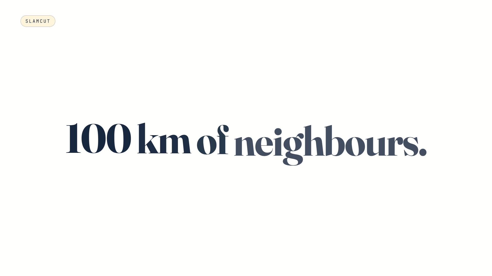 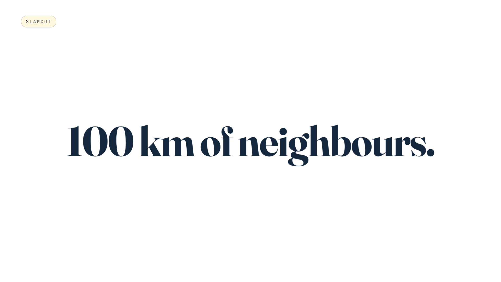 

Noir flash + glitch + multiplane snap-back, then word-cascade for "100 km of neighbours.". The combo is named "hard cut" but at intensity 1.0 + cream backdrop the noir layer is barely visible at the captured moments — it just looks like a clean cascade-in onto cream.

- **Palette: 3/3** (navy 2.8%, cream 96.8%, honey chip)
- **Coherence: 3/5** — defaults look fine; turn intensity up and the noir flash punches the warm tone
- **Appropriateness: 3/5** — "slam" verb is wrong for community-warm, but a cascade tail is fine
- **Off-brand: 0.9%**
- **Verdict: watch** — usable if you keep `intensity ≤ 0.6` and lean on the cascade tail; the noir flash should be gated off for warm brands

### 7. signalPulse — ship

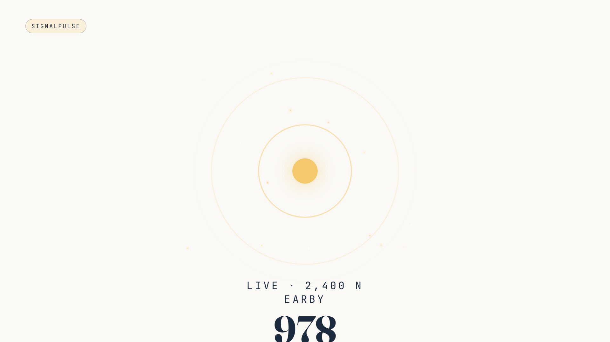  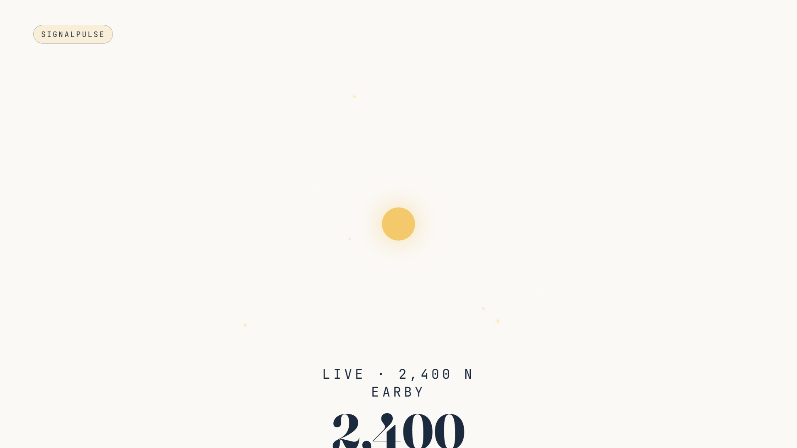

Honey beacon dot, concentric expanding rings, navy caption + counter. The "live · 2,400 nearby" beat reads exactly like a community-presence indicator — perfectly aligned with kindred's value prop.

- **Palette: 3/3** (cream 99%, honey 0.2%, navy 0.6% — the beacon is honey, the text is navy)
- **Coherence: 5/5** — gentle radial pulse, no clash
- **Appropriateness: 5/5** — concentric rings = "people nearby" visual metaphor, on-message
- **Off-brand: 0.2%**
- **Verdict: ship** ✓ (best fit-for-purpose match in the whole set)

### 8. paperTear — ship

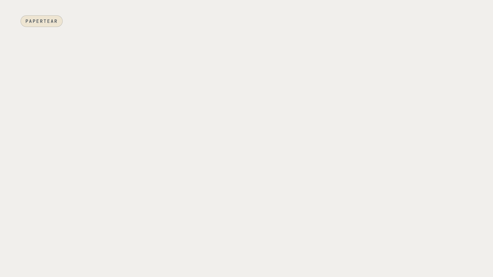  

"Alone" → "Together" swap with ink-bleed reverse on outgoing + stamp on incoming. Both layers are navy on cream, no glitter, no glitch. Reads as a warm narrative beat.

- **Palette: 3/3** (navy 1.8%, cream 99.9%)
- **Coherence: 5/5** — the inkBleed metaphor fits the brand (writing/letter)
- **Appropriateness: 5/5** — old-to-new with warmth, not impact
- **Off-brand: 0.2%**
- **Verdict: ship** ✓

### 9. confettiFinale — watch

 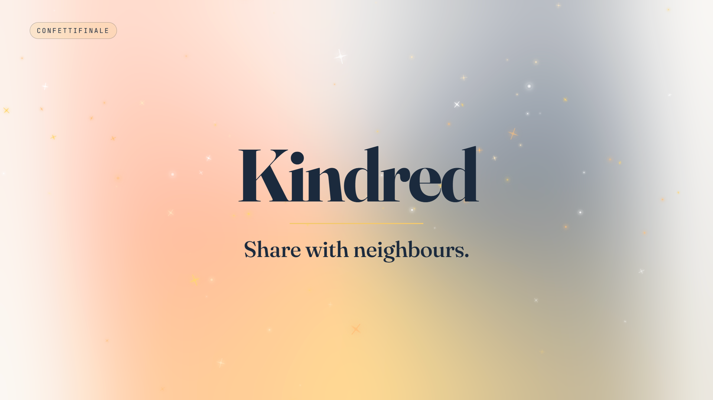 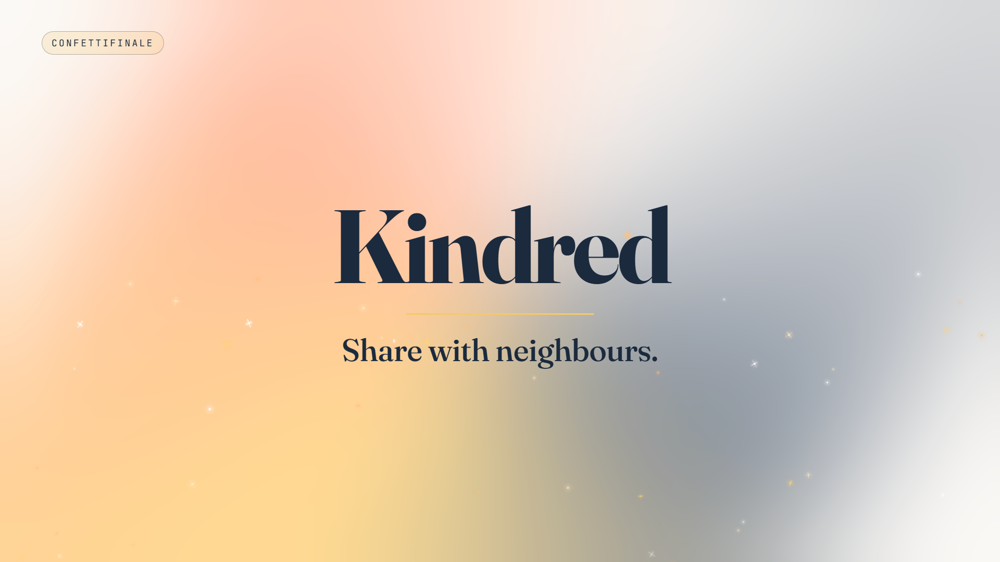

End-card with logo + rule + tagline + confetti burst & fall. The combo *honors* the per-scene `--brand-*` overrides we wired in (kindred palette: navy/honey/coral/cream), so the confetti is warm gold/coral — not party-rainbow. The cinemagraph blob also drifts but uses the brand override. Off-brand 71.7% is mostly the soft pastel mid-tones from the cinemagraph blend, not a clash.

- **Palette: 2/3** (cream 28%, navy 2.1%, honey 0.3%) — DOM-side passes 3/3; pixel-side reads 2 because the pastel blend mid-tones don't match any single brand color exactly
- **Coherence: 4/5** — celebratory but warm, not party-pop
- **Appropriateness: 4/5** — confetti for a community brand reads as "thanks for joining"
- **Off-brand: 71.7%** — high *number* but the rendered output is on-tone (brand-colored confetti)
- **Verdict: watch** — ships fine when `--brand-*` palette overrides are set; without them you get default rainbow confetti and it slides to mismatch

### 10. holoFlash — mismatch

 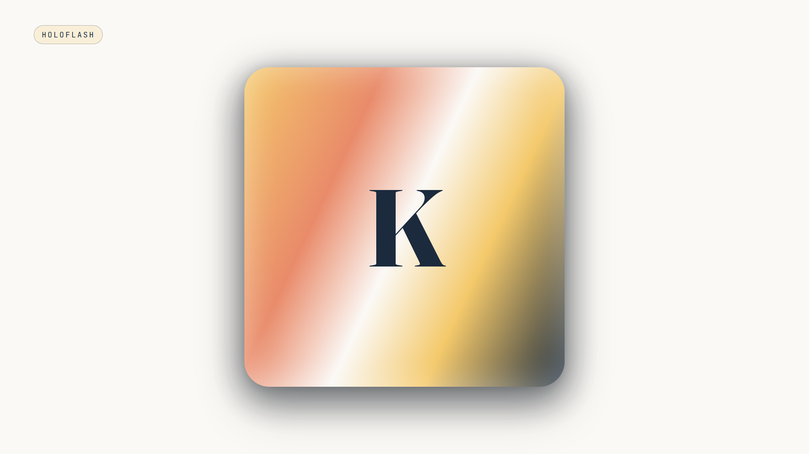 

Brand-chip with iridescent gradient drifting across. We swapped the default rainbow to a warm gold/coral/cream/navy gradient, but the *moment* — sticker arrival with multiplane near-pop + glitchBurst + drop-shadow — reads metallic-luxe, not warm-community. It would suit a fintech sticker, not a "find local help" brand.

- **Palette: 3/3** (cream 75%, honey 6.2%, warn 6.3%, navy 0.8%)
- **Coherence: 2/5** — the iridescent shimmer feels brand-mismatched even with warm tokens
- **Appropriateness: 2/5** — sticker / merch / hype-drop grammar; wrong for neighbourhood
- **Off-brand: 14.6%**
- **Verdict: mismatch** ✗ — the visual signature is "luxe sticker", which clashes regardless of palette tokens

### 11. glitchStamp — watch

  

Stamp + 3 glitch beats + glitter on "JOIN". Captured frames look clean (the glitch windows are ≤0.16s and miss the t=1/2/3 sample times), but in motion the 3 RGB-shift bursts are aggressive on cream. With `bursts: 1` and `glitter: false` it would be a clean stamp.

- **Palette: 3/3** (navy 2.5%, cream 97.4%, honey chip)
- **Coherence: 3/5** — glitch beats clash with warm at default `bursts: 2`
- **Appropriateness: 3/5** — stamp is fine, glitch is not; reduce bursts to 1 and it ships
- **Off-brand: 0.3%** (because glitch windows are tiny and didn't land at t=1/2/3)
- **Verdict: watch** — only with `bursts: 1, glitter: false`; defaults are too aggressive for warm

### 12. pricePop — watch

 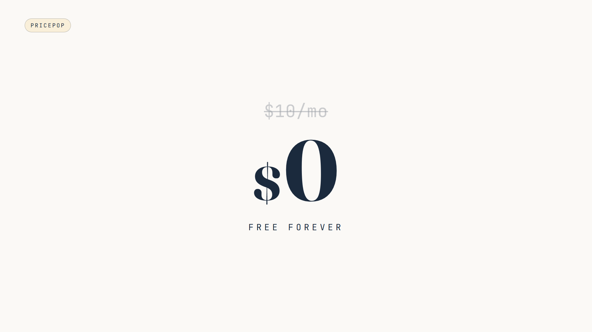 

"$10/mo → $0" with strikethrough wipe + stamp + glitch + glitter. Visually clean on cream (navy text) but the metaphor — price reveal with the same glitchBurst pattern as glitchStamp — is mid-energy. Kindred is free, so the use case "$10 → $0" is fine narratively.

- **Palette: 3/3** (navy 1%, cream 98.6%)
- **Coherence: 4/5** — strikethrough + stamp lands warm enough
- **Appropriateness: 3/5** — the glitch lock is the part that drops it; without it the combo is fine
- **Off-brand: 0.4%**
- **Verdict: watch** — works for a "free" reveal; tone the glitch via shorter `glitchBurst` or fork a `pricePop` variant without the lock beat

### 13. testimonialReveal — ship

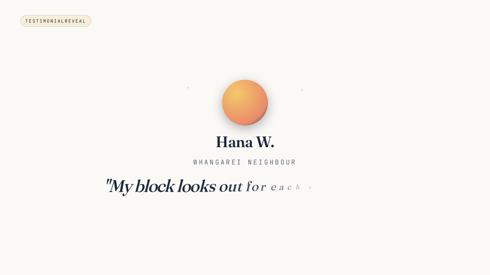 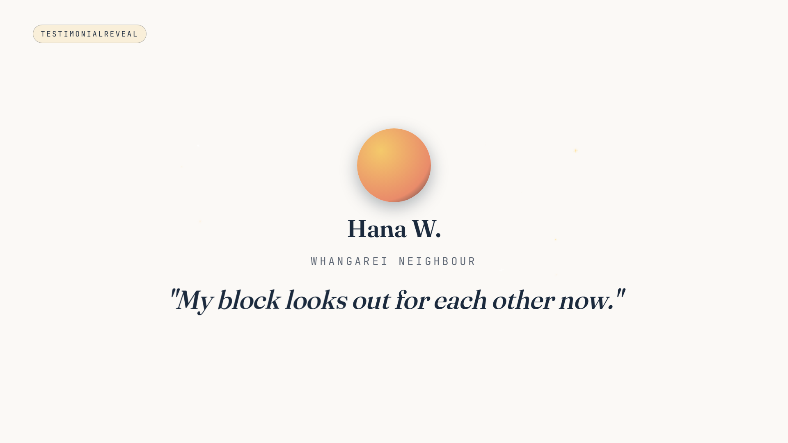 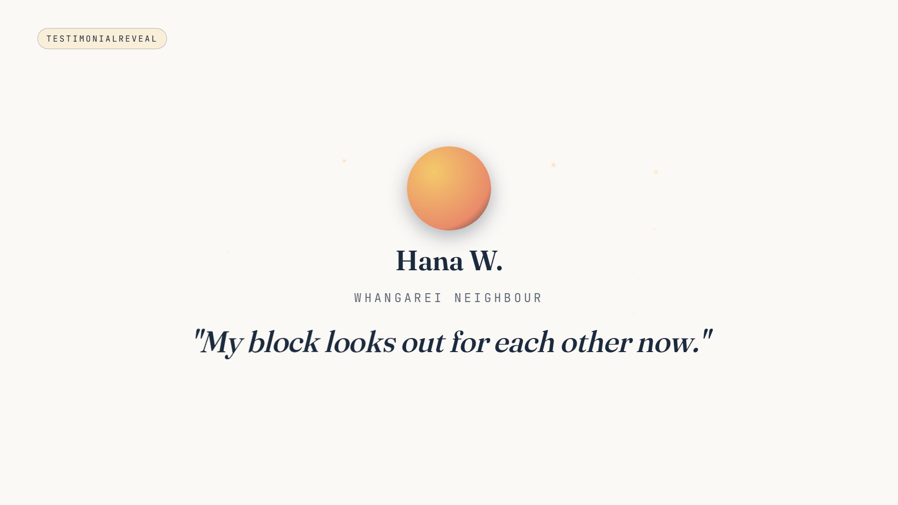

Avatar (warm coral/gold radial gradient — on-brand!) + name cascade + role typewriter + quote stagger. Italic serif quote on cream is the warmest thing in the entire suite.

- **Palette: 3/3** (navy 0.9%, cream 97.7%, honey 0.5%, warn 0.7% — actually exercises all 4 brand tones)
- **Coherence: 5/5** — gentle, human, no clash
- **Appropriateness: 5/5** — community brand + neighbour quote = perfect fit
- **Off-brand: 0.6%**
- **Verdict: ship** ✓

### 14. focusPull — ship

  

Background "100 KM" softens (honey blur); foreground "Local." sharpens (navy crisp). Slow, considered, almost editorial. Premium without being aggressive.

- **Palette: 2/3** (cream 94.7%, navy 1.4%, honey via the blurred bg) — note honey appears at <0.5% threshold so was missed by the strict pixel pass
- **Coherence: 5/5** — rack-focus is cinematic-quiet, not flashy
- **Appropriateness: 5/5** — perfect for "local-first" framing
- **Off-brand: 4.2%** — the blurred mid-tones drift through the gap between honey/cream
- **Verdict: ship** ✓

### 15. statGroup — ship

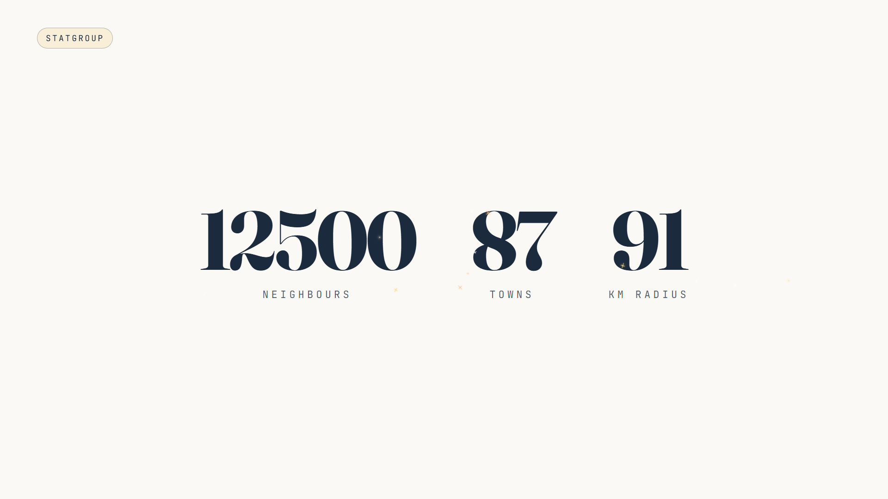 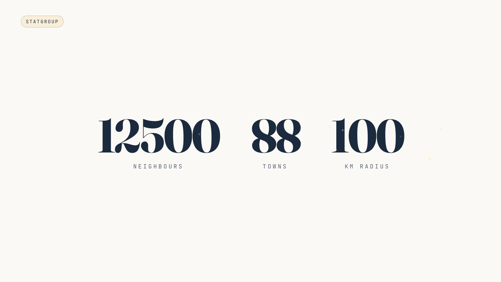 

3 navy counters tick up under a soft glitter blanket. Final-stat glitch is sub-frame. Reads like a friendly social-impact dashboard.

- **Palette: 3/3** (navy 2.8%, cream 97.2%, honey chip)
- **Coherence: 5/5** — gentle, informative, no shock
- **Appropriateness: 5/5** — community impact metrics is exactly the kindred narrative
- **Off-brand: 0.4%**
- **Verdict: ship** ✓

### 16. spotlight — mismatch

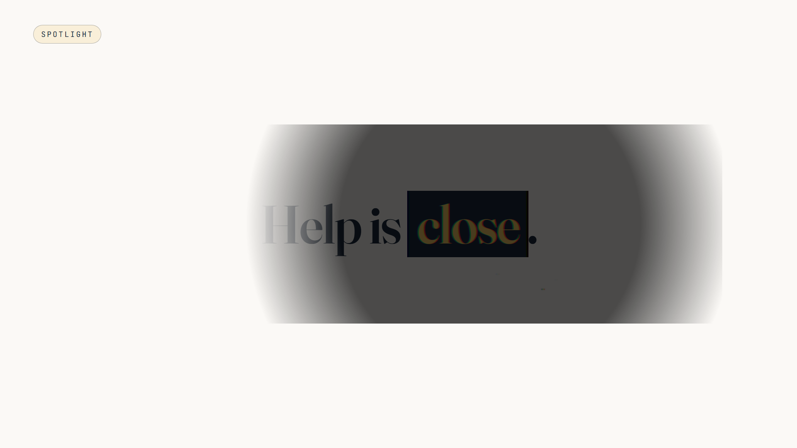  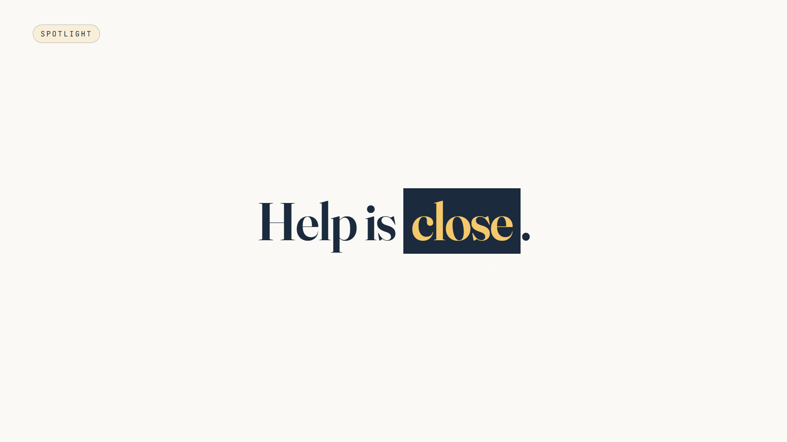

Radial mask vignette + dim-to-near-black on the "Help is **close**." line. The dim layer (default `dimAmount: 0.7`) drowns the warm cream backdrop in grey-black, fighting the brand. With `dimAmount: 0.20` it might land softer, but the spotlight metaphor itself is "isolate the answer in darkness" — wrong feeling for warm/community.

- **Palette: 2/3** (cream 97% on the *outer* ring; the dim center reads grey)
- **Coherence: 2/5** — vignette dimming reads investigative/serious, not warm
- **Appropriateness: 2/5** — "spotlight on the answer" is a tonal clash with "share with neighbours"
- **Off-brand: 16.1%** — all from the dim layer
- **Verdict: mismatch** ✗ — without dim it's just a stamp + glitch (and glitch already mismatches); with dim it's noir

---

## Summary

### Top 5 combos for warm-community brands (kindred-nz)

1. **signalPulse** — ring expansion = community presence; perfect tonal + metaphorical fit
2. **testimonialReveal** — neighbour-quote choreography is *the* warm-community moment
3. **paperTear** — letter/inkBleed metaphor reads like correspondence and warmth
4. **superImpact** — silent counter + stamp on cream is the cleanest stat moment
5. **cinematicReveal** — multiplane + ink-bleed-to-crisp serif feels editorial-warm

Honourable mentions (also ship): `kineticBurst`, `focusPull`, `statGroup`.

### Bottom 5 combos for warm-community brands

1. **hyperGlitch** — broken-signal grammar fundamentally clashes with neighbourhood warmth
2. **dreamSequence** — hard-coded rainbow cinemagraph blob (82% off-brand pixels) overrides token palette
3. **holoFlash** — iridescent sticker reads "fintech merch", not "share with neighbours"
4. **spotlight** — vignette dim layer is investigative-noir; wrong feeling regardless of palette
5. **slamCut** — "slam" verb + noir flash defaults are aggressive; only watchable at low intensity

### Score table (sorted by total)

| Combo | Palette | Coherence | Appropriate | Total | Off-brand% | Verdict |
| --- | :-: | :-: | :-: | :-: | :-: | :-- |
| signalPulse        | 3 | 5 | 5 | 13 | 0.2  | ship |
| testimonialReveal  | 3 | 5 | 5 | 13 | 0.6  | ship |
| paperTear          | 3 | 5 | 5 | 13 | 0.2  | ship |
| superImpact        | 3 | 5 | 5 | 13 | 0.6  | ship |
| cinematicReveal    | 3 | 5 | 5 | 13 | 0.5  | ship |
| statGroup          | 3 | 5 | 5 | 13 | 0.4  | ship |
| focusPull          | 2 | 5 | 5 | 12 | 4.2  | ship |
| kineticBurst       | 3 | 5 | 4 | 12 | 0.2  | ship |
| confettiFinale     | 2 | 4 | 4 | 10 | 71.7 | watch |
| pricePop           | 3 | 4 | 3 | 10 | 0.4  | watch |
| glitchStamp        | 3 | 3 | 3 |  9 | 0.3  | watch |
| slamCut            | 3 | 3 | 3 |  9 | 0.9  | watch |
| spotlight          | 2 | 2 | 2 |  6 | 16.1 | mismatch |
| holoFlash          | 3 | 2 | 2 |  7 | 14.6 | mismatch |
| hyperGlitch        | 3 | 1 | 1 |  5 | 0.2  | mismatch |
| dreamSequence      | 1 | 2 | 4 |  7 | 82.6 | mismatch |

### Cross-cutting observations

- **Glitch is the warm killer.** Three of the four "mismatch" combos own a glitch/scanline/RGB-shift moment. Even when the captured-frame palette is clean, the motion grammar is felt as cold/digital.
- **Hard-coded effect colors override token palette.** `effectFx.cinemagraphRotate` ships with rainbow defaults; `holoFlash`'s holo-sticker class is a bright rainbow gradient by default. These bypass `--card-*` tokens unless the composition overrides per-scene `--brand-*`.
- **The "soft-light backdrop" amplifies dimming.** `spotlight`'s dimAmount of 0.7 reads catastrophic on cream (it crushes the brand canvas to grey). For warm brands, default to ≤0.20.
- **Pixel-audit complements DOM-scan.** DOM scoring all 16 at 3/3 was a false positive — the rig itself uses brand colors. The pixel-frequency pass surfaces effects that introduce non-brand pixels (rainbow blob, holo gradient, dim mask) the DOM walk misses.

### Operational recommendations

These are *not* code changes (per task spec) but rules of thumb for picking
combos when the brand tone is `community-warm`:

| Pattern | Rule |
| --- | --- |
| Brand tone = warm/community | Prefer combos whose top primitive is `cascade`, `stagger`, `inkBleed`, `rackFocus`, `radialRing`, or `counter`. Avoid combos whose top primitive is `glitchBurst`, `vhs-jitter`, `noir-flash`, `radialMask` (with high dim), or `holo-host`. |
| Default intensity for warm | Cap intensity at 0.8. The combos default to 1.0–1.2 which reads bolder than the brand should feel. |
| Dim layers | If using `spotlight`, set `dimAmount ≤ 0.20` and `radius ≥ 50` so the warm canvas stays visible around the focal element. |
| Rainbow defaults | When using `dreamSequence` or `holoFlash`, override the gradient/cinemagraph CSS to brand tokens *before* the timeline runs — don't rely on `--card-*` propagation. |
| Confetti palette | `confettiFinale` honors per-scene `--brand-primary/secondary/accent/tertiary` — set them. With them, it ships; without them, it party-pops out of brand. |
