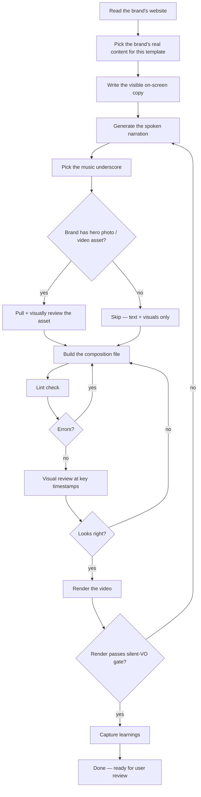

# Skill — Make a {{VIDEO TYPE}} video

A step-by-step recipe Claude Code follows to produce one {{LENGTH}} {{ASPECT}} video in the {{ARCHETYPE}} archetype. Each step says what Claude does, who does the work, and what comes out the other side.

> This is a copy of the master skill template. Replace every `{{...}}` placeholder with the specifics for your video type before using.

---

## The flow at a glance

---

## What this video is for

A {{LENGTH}} {{ASPECT}} video that {{PURPOSE — one sentence describing what this template communicates}}. {{KEY VISUAL ANCHOR — e.g. Roman numerals, a single big italic question, a photo + pull-quote}}. {{PACE — e.g. slow / contemplative, fast / kinetic, mid-tempo}}. {{PALETTE + TYPE — e.g. black + gold + parchment, Georgia serif}}.

- Length: {{N}} seconds
- Shape: {{vertical 1080×1920 9:16 / square 1080×1080 1:1 / horizontal 1920×1080 16:9}}
- Register: {{kinetic-pop / warm-community / documentary / quiet-premium / contemplative}}
- Best for: {{2-4 brand types where this template fits}}
- Not for: {{2-3 brand types where this is the wrong template}}

---

## Before Claude starts

- A URL for the brand (or pasted brand copy if URL is behind a bot wall)
- {{TEMPLATE-SPECIFIC INPUT 1 — e.g. a three-step process, a single piercing question, a quote from a real witness}}
- {{TEMPLATE-SPECIFIC INPUT 2 — e.g. brand wordmark, CTA verb, hero photo}}

If the brand doesn't have {{REQUIRED CONTENT SHAPE}}, this isn't the right skill — use {{ALTERNATIVE SKILL NAME}} instead.

---

## The steps

### Step 1 — Read the brand's website

**What Claude does:** Opens the brand's homepage in a real browser, waits for it to settle, and reads everything: headlines, paragraphs, colors, logo. Saves the raw findings so the next steps can use them.

**Who does the work:** the website reader.

**Output:** A record of the brand's actual words, palette, and asset URLs.

**Bot-wall guard:** if the brand's site returns a captcha page, Claude refuses to proceed and asks the user to paste the brand copy directly.

---

### Step 2 — Pick the brand's real content for this template

**What Claude does:** Reads the record from Step 1 and finds {{TEMPLATE-SPECIFIC CONTENT — e.g. the brand's three-step process, the single piercing question, the testimonial quote, the launch promise}}. Uses the brand's exact wording. **Never invents** — if the brand doesn't have what this template needs, Claude stops and asks the user.

**Who does the work:** the file reader and the pattern finder.

**Output:** {{LIST OF CONTENT SLOTS — e.g. three step headlines + three body lines + closing line; or one question + wordmark + CTA + URL; or quote + name + role + wordmark}}.

---

### Step 3 — Write the visible on-screen copy

**What Claude does:** Drops the brand's words from Step 2 into the template's {{N}} content slots. Keeps copy short — every line on screen has to read at a glance. Italic for emotional / questioning lines; regular weight for declarative lines; sans-serif for utility lines (URLs, citations, attribution).

**Who does the work:** the file writer.

**Output:** A list of slot-fills ready to drop into the template at Step 7.

---

### Step 4 — Generate the spoken narration

**What Claude does:** Writes a {{WORD COUNT — e.g. 25 / 60 / 75 / 110}}-word script that tracks the on-screen content but uses its own voicing — not a parrot of the visible text. Then turns the script into a real voice file ({{DURATION RANGE — e.g. 12-14s / 25-28s / 35-40s / 50-55s}}, fits cleanly inside the {{N}}-second timeline before the closing CTA). The voice for this register is {{VOICE PICK — e.g. cinematic American slow, NZ baritone, warm Australian female}}.

**Who does the work:** the file writer for the script, then the voice maker for the audio.

**Output:** A spoken narration audio file plus a captions file with word-level timing.

---

### Step 5 — Pick the music underscore

**What Claude does:** Picks a track from the {{SHORTLIST NAME — e.g. contemplative / warm-community / kinetic-pop / documentary}} shortlist. The pre-curated list lives in the project; Claude picks the one whose mood matches the brand. Music plays under the narration at low volume so the voice stays clear.

**Who does the work:** the file reader for the shortlist, then the asset fetcher if a download is needed.

**Output:** A music file path that the template's audio tag points at.

---

### Step 6 — Pull a hero asset (optional / required — depends on template)

**What Claude does:** {{REQUIRED OR OPTIONAL?}} If required, downloads {{ASSET TYPE — e.g. a portrait photo, a product shot, an atmospheric backdrop, a video clip}}. If the brand has one on its homepage, prefers that. Otherwise picks from stock. **Visual review is mandatory** — Claude opens the asset and confirms it actually fits the brand's vibe before using it. Filenames lie.

**Who does the work:** the asset fetcher, then the image viewer.

**Output:** An asset file — only used if it survives the visual-review gate.

---

### Step 7 — Build the composition file

**What Claude does:** Copies the {{TEMPLATE FILE NAME}} template, replaces the content slots with the brand's words from Steps 2–4, swaps in the brand wordmark and CTA, points the audio tags at the files from Steps 4 and 5{{IF PHOTO/VIDEO USED: , wires in the asset from Step 6}}. Adds the persistent ambient brand emblem.

**Who does the work:** the file reader for the template, the file writer for the new copy, the file editor for slot-by-slot replacement.

**Output:** A new composition file ready to render.

---

### Step 8 — Lint check + visual review before render

**What Claude does:** Runs the project's lint check first to catch any structural mistakes (zero errors required, warnings are fine). Then captures still frames at key moments — {{LIST OF KEY TIMESTAMPS FOR THIS TEMPLATE — e.g. cold open, mid-question, wordmark reveal, CTA hold}} — and looks at each one. Looking specifically for: text fitting on screen without breaking words, brand emblem visible at the corner, type readable against the background.

This is the most important step. If it looks wrong here, the render will look wrong too.

**Who does the work:** the linter, the frame capturer, then the image viewer.

**Output:** A folder of still frames + a verdict in plain English: ship, watch, or iterate.

---

### Step 9 — Render the video

**What Claude does:** Stages the composition as the project's root index file, runs the renderer, waits for it to finish. The render gate refuses to start if the narration is still the silent placeholder — protects against shipping a silent video.

Render takes about {{ESTIMATED RENDER TIME — e.g. 1-2 minutes / 4 minutes / 7-9 minutes}} for a {{LENGTH}}-second composition.

**Who does the work:** the renderer, with the background watcher armed for completion notification.

**Output:** A finished MP4 video plus an auto-graded version.

---

### Step 10 — Capture what was learned

**What Claude does:** Adds an entry to the project's learnings log — what worked first try, what surprised, what took multiple iterations. Captures any new pattern that should propagate to the next render. Promotes pitfalls into the canonical pitfalls section so the next session sees them immediately.

**Who does the work:** the file reader on the learnings log, then the file editor to append the new entry.

**Output:** Updated learnings log and (if a register-level rule emerged) updated canonical patterns reference.

---

## How Claude knows the video is done

- Lint passes with zero errors (warnings are fine if they were already there before this build)
- Frame review at every key moment shows clean layout, brand emblem present, text fits
- Real narration is wired (silent-VO render gate is satisfied)
- The brand wordmark + CTA + URL appear at the close (not just at the very last frame)
- The closing line comes from brand canon, not invented copy
- The user reviews the render and says ship — final gate is always the user's eye

---

## What Claude refuses to do

- Render with the silent placeholder narration
- Invent outcome lines, stats, taglines, or aphorisms — only the brand's own words
- Skip the visual review before rendering
- Render twice without capturing learnings between

---

## When this skill takes longer than expected

Common reasons:
- Brand site is behind a bot wall — Step 1 fails, Claude asks for pasted copy
- The brand doesn't have the content shape this template needs — wrong template, switch to a sibling
- Render fails at a late frame — usually a memory issue, kill leftover browser processes and retry
- Voice sounds wrong — try a different voice from the register's voice library or adjust pace

---

## Related skills

{{LIST SIBLING SKILLS IN THE SAME REGISTER — e.g.:
- `make-hook-15s.md` — for a single piercing question (scroll-stopper)
- `make-testimonial-30s.md` — for a testimonial / pull-quote
- `make-methodology-45s.md` — for a 3-step methodology
- `make-cinematic-launch-60s.md` — for a cinematic launch trailer}}

Each skill follows the same 10-step shape; only the content slots, the timing, and the asset requirements differ.

---

## Glossary — what the worker names mean

| Worker name in this doc | What it actually does in Claude Code |
|---|---|
| the website reader | Loads a URL in a headless browser and extracts text + colors + assets |
| the file reader | Opens a file and reads its contents |
| the file writer | Creates a new file with given contents |
| the file editor | Makes targeted edits to an existing file |
| the pattern finder | Searches across files for a pattern or string |
| the voice maker | Generates a TTS voice file from a text script |
| the asset fetcher | Downloads a photo, video, or music file from a stock source |
| the image viewer | Opens an image and lets Claude see it for visual judgment |
| the linter | Runs the project's static checks against the composition |
| the frame capturer | Renders still frames at specified seconds for review |
| the renderer | Captures every frame and encodes the final MP4 |
| the background watcher | Streams events from a long-running process so Claude can keep working |
