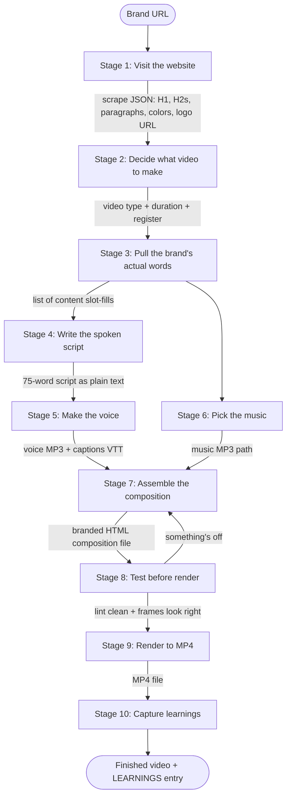
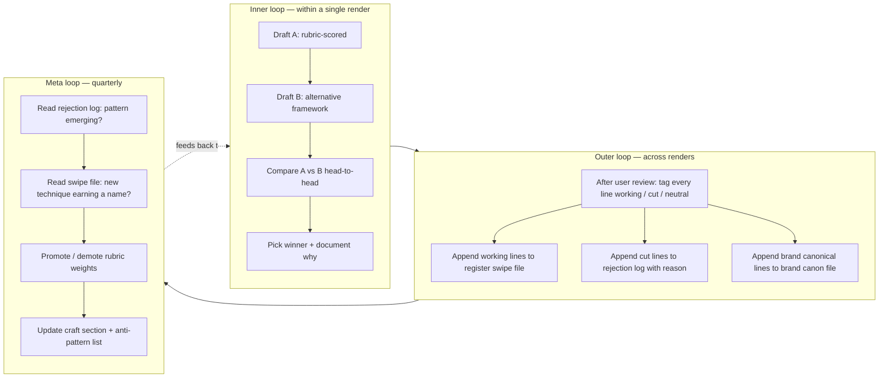

# How a video gets made

The actual process — what flows in, what gets made at each stage, what flows out, and how the next stage uses it. From a brand URL to a finished MP4.

> **This is the founding doc. Read it first on any video task.** It's slim by design — stage-specific detail lives in the companion docs below. Pull a companion when you're working that stage; don't pre-load them all.

---

## Companion docs — where stage-specific detail lives

| Stage | What lives there | Companion docs |
|---|---|---|
| **0 — Setup** | Match brand to an already-locked template before building from scratch | [`docs/template-models.md`](../template-models.md), [`docs/suggest-comp-2026-04-26.md`](../suggest-comp-2026-04-26.md) |
| **1 — Capture** | URL scraping tools + brand fingerprint cache | [`docs/extract-copy-framework-2026-04-26.md`](../extract-copy-framework-2026-04-26.md), [`docs/brand-fingerprints.md`](../brand-fingerprints.md) |
| **2 — Pick archetype** | Locked template registry; archetype × register matrix | [`docs/template-models.md`](../template-models.md) |
| **3 — Copywriting (THE most important stage)** | Master copy frameworks (Schwartz / Caples / Halbert / Bencivenga / Ogilvy / Hopkins / Sugarman / Collier), 6-question rubric, A/B inner loop, swipe files, brand canon | [`docs/swipe/README.md`](../swipe/README.md), [`docs/swipe/<register>-hooks.md`](../swipe/), [`docs/swipe/<register>-bodies.md`](../swipe/), [`docs/swipe/rejected.md`](../swipe/rejected.md), [`docs/copy-research/`](../copy-research/) (5 files: direct-response, brand-storytelling, modern-digital, video-screen, short-form-microcopy) |
| **5 — TTS voice** | Voice pick per register; male/female options; rate + pitch | [`docs/rd/edge-tts-male-voices.md`](../rd/edge-tts-male-voices.md) |
| **6 — Music** | Curated shortlists per register; manual Pixabay workflow | [`docs/playbooks/music.md`](../playbooks/music.md), [`docs/playbooks/music-shortlists.md`](../playbooks/music-shortlists.md), `assets/music-shortlists/*.json` |
| **7 — Assemble** | Per-archetype layout specs + per-register style specs + reusable patterns + per-archetype recipes + **600-effect catalog** | [`docs/playbooks/composition-assembly.md`](../playbooks/composition-assembly.md), [`docs/playbooks/transitions.md`](../playbooks/transitions.md), [`docs/playbooks/atmospheric-polish.md`](../playbooks/atmospheric-polish.md), [`docs/playbooks/cards-library.md`](../playbooks/cards-library.md), [`docs/comp-diff-2026-04-26.md`](../comp-diff-2026-04-26.md), [`docs/effects/INDEX.md`](../effects/INDEX.md), [`docs/effects/CATALOG.json`](../effects/CATALOG.json), [`docs/skills/make-cinematic-launch-60s.md`](make-cinematic-launch-60s.md), [`docs/skills/make-methodology-45s.md`](make-methodology-45s.md), [`docs/skills/_template-make-video.md`](_template-make-video.md) |
| **8 — Test before render** | S-series layout rules (S1-S20+); platform-mechanical rules; anti-patterns | [`docs/social-video-patterns.md`](../social-video-patterns.md) |
| **9 — Render** | Renderer architecture + performance roadmap | [`docs/render-vite-roadmap.md`](../render-vite-roadmap.md) |
| **10 — Capture learnings** | Per-render verdict log + cross-render pattern library + waves history | [`docs/render-learnings/LEDGER.md`](../render-learnings/LEDGER.md), [`docs/render-learnings/SUGGESTIONS.md`](../render-learnings/SUGGESTIONS.md), [`LEARNINGS.md`](../../LEARNINGS.md) |

**Always-loaded user memory:** `~/.claude/projects/<project>/memory/MEMORY.md` — durable preferences (orchestrator role, voice locks, register rules, locked templates). Read first on every session.

**Quickstart for first-time setup:** [`docs/QUICKSTART.md`](../QUICKSTART.md) — clone → first render walkthrough.

**Archived (do not read):** `docs/_archive/` — superseded older process docs. The contents are obsolete; this founding doc replaces them.

---

## The flow at a glance



---

## Video types — the generic archetypes

Every video Claude makes is one of these archetypes. The archetype dictates the content shape (what slots the template needs filled), the duration range, and the natural framework. The archetype is brand-agnostic — any brand in any register can fit any archetype, as long as the brand has the content shape that archetype needs.

| Archetype | Length | What it does | Required brand inputs | Natural framework |
|---|---|---|---|---|
| **Hook** | 15s | Single piercing claim or question + brand reveal + URL. Top-of-funnel scroll-stopper. | One sharp claim or question + wordmark + CTA + URL | Q-Payoff |
| **Stat reveal** | 15-20s | Dramatize one real number or fact. Single-point-of-proof. | One real published stat + label + claim line + CTA | Number-anchored AIDA |
| **Before-after** | 20-30s | Split or sequential reveal of pain → solution. Transformation arc. | Concrete "before" state + concrete "after" state + bridge | BAB |
| **Quick answer / FAQ** | 30s | 2-3 common objections answered. Removes friction. | 2-3 real customer questions + brand's real answers | PAS per question |
| **Testimonial** | 30-45s | Pull-quote from a real witness with attribution. Authority by association. | Real customer quote + name + role + brand wordmark | Quote-attribution-CTA |
| **Product launch** | 30s | Name the new thing, show it, CTA. New-release announcement. | Product name + key benefit + launch date / availability + CTA | AIDA |
| **3-step methodology** | 45s | Roman numerals or numbered steps for a process. Educational. | Three-step process from brand canon + cold open + closing line | BAB at macro, command-payoff per step |
| **Founder story** | 45-60s | Origin narrative in first-person voice. | Founder name + 2-3 origin beats + brand promise | Story arc |
| **Case study** | 45-60s | Situation → action → result, narrated. Proof-by-narrative. | Real customer / scenario + concrete situation + concrete result | STAR |
| **Manifesto** | 60s | Values declaration, "what we believe." Brand alignment. | 5-7 declarative belief statements in brand voice | Liturgical / repetitive |
| **Cinematic launch / reveal** | 60s | Anticipation → name → demo → promise → CTA. Trailer-shaped. | Real stat + verse-or-claim line + 2-line promise + wordmark + CTA | Story arc |

The template family (kinetic-pop / warm-community / documentary / quiet-premium / contemplative) chooses the **register** — palette, type voice, motion language. The archetype above chooses the **shape**. Same archetype + different register = same content slots filled with a different voice.

**How to pick the archetype:** read the brand at Stage 1, ask "what content does this brand actually have?". If they have a stat, lean stat-reveal or cinematic-launch. If they have a 3-step process, lean methodology. If they have a customer quote, lean testimonial. The brand's content dictates the archetype, not the other way around.

**Refusal rule:** if no archetype fits the brand's content, don't manufacture content to fit an archetype. Tell the user the brand needs more raw material before a video can be made.

---

## Stage 0 — Check for an existing brand folder

**Before Stage 1, check if `videos/<brand-slug>/` already exists.**

If it does, the brand has been worked on before. Don't re-scrape, don't re-design, don't re-write planning docs from scratch — read what's already there. The folder's predictable layout means you know exactly where to look:

```
videos/<brand>/
├── README.md            ← READ FIRST: what this brand is, current status, render history
├── DESIGN.md            ← Brand cheat-sheet (Stage 2 output) — palette, type, tone, vibe
├── SCRIPT.md            ← Latest narration script (Stage 4 output)
├── STORYBOARD.md        ← Per-beat creative direction (optional, only if a new template was built)
├── tokens.css           ← Brand design tokens (palette + type vars)
├── effects.css          ← Brand-specific ported effects from CATALOG (if any)
├── capture/             ← Stage 1 scrape: tokens.json, visible-text.txt, screenshots/, assets/
├── compositions/        ← All composition .html + .copy.json + .meta.json + .music.json
├── voiceover/           ← TTS files (.mp3 + .vtt) for every script version
├── assets/              ← Brand-specific assets (downloaded SVGs, photos, brand SVGs)
└── (variants)           ← e.g. tokens-override.css, assets-tone/ — variants of the same brand
```

**The "existing brand" flow:**

1. **Read `videos/<brand>/README.md`** — current status, locked templates, render history, known issues.
2. **Read `videos/<brand>/DESIGN.md`** — brand cheat-sheet. Don't re-derive what's already captured.
3. **List `videos/<brand>/compositions/`** — see what angles have already been tried. Each composition file represents one angle (manifesto / questions / directive / product-demo / pain-naming / comparison / etc.).
4. **Check `docs/render-learnings/LEDGER.md`** for past verdicts on this brand — what shipped, what failed, what the user said.
5. **Pick a NEW angle** (or refine an existing one). See "Multiple angles per brand" below.
6. **Skip directly to Stage 3 (Copywriting)** — Stage 1 (capture) and Stage 2 (archetype/register pick) were already done; only re-run capture if the brand's website has materially changed.

### Multiple angles per brand — the standard pattern

A brand folder is expected to grow MULTIPLE compositions over time, each exploring a different angle on the same brand. This is by design — different angles work for different funnel positions, audiences, and platforms.

For Singularity Convergence as the worked example, four angles shipped:

| File | Angle | Structure |
|---|---|---|
| `singularity-convergence.html` | manifesto v2 (declarative) | "We believe X / Y / Z" |
| `singularity-convergence-manifesto.html` | manifesto v3 (declarative, polished) | Same shape, S16-S18 fixes |
| `singularity-convergence-questions.html` | interrogative invitation | "What weighs on you? / What can you not forgive?" |
| `singularity-convergence-directive.html` | contractual / sacred-denials (LOCKED) | "We will never force belief / manipulate / judge" |

**How to pick a NEW angle for an existing brand:**

1. List the angles already covered (one per composition file).
2. Identify the structural opposites — declarative ↔ interrogative, abstract ↔ concrete, brand-voice ↔ founder-voice ↔ testimonial-voice, problem-first ↔ solution-first ↔ proof-first, future-oriented ↔ origin-oriented.
3. Pick an opposite that the brand has content for. The brand-content gate (Stage 2 refusal rule) still applies — don't manufacture content to fit an angle.
4. Reference the brand's awareness level (Schwartz's 5 levels, founding doc Stage 3 Job C) — different angles map to different awareness levels:
   - **Pain-naming hook** ↔ unaware audience
   - **Problem agitation** ↔ problem-aware audience  
   - **Brand-as-solution** ↔ solution-aware audience
   - **Comparison / proof / offer** ↔ product-aware audience
   - **Direct CTA** ↔ most-aware audience

**Naming convention** for new-angle compositions: `videos/<brand>/compositions/<brand>-<angle>.html`. The angle in the filename should be a single word or hyphenated phrase that names the structural shape (`manifesto`, `questions`, `directive`, `pain-naming`, `comparison`, `founder-story`, `testimonial`, `demo`).

**The "new brand" flow:**

If `videos/<brand-slug>/` does NOT exist, scaffold it from the canonical template before Stage 1:

```bash
node scripts/new-brand.mjs <slug> "Display Name" https://brand.url
```

This copies `videos/_template/` to `videos/<slug>/`, fills in `<BRAND>` / `<brand-slug>` / `<url>` placeholders across the README / DESIGN / SCRIPT / STORYBOARD / tokens.css skeletons, and creates `renders/<slug>/`. Result: the canonical per-brand layout from `STRUCTURE.md`, ready for Stage 1.

Then proceed to Stage 1. Stage 1 writes into `videos/<brand-slug>/capture/`, Stage 2 fills `videos/<brand-slug>/DESIGN.md`, Stage 3 fills `videos/<brand-slug>/SCRIPT.md`, etc. — the placeholders in each scaffold file get replaced with real content as each stage runs.

**Refusal rule:** never write per-brand artifacts to root or to `compositions/`/`assets/`/`design/`. Those are template/shared/system folders — per-brand stuff goes in `videos/<brand>/` always. See [`STRUCTURE.md`](../../STRUCTURE.md) for the full project layout.

---

## Stage 1 — Visit the website

**Flowing in:** A brand URL.

**What happens:** The website reader (a headless Chrome browser controlled by Playwright) opens the URL. It waits up to 20 seconds for the page to fully load — some sites need a moment to settle JavaScript, animations, fonts, lazy-loaded images. Once settled, it walks the DOM and pulls every visible signal: the H1 (the brand's biggest claim), the H2s (the section headings), the H3s (sub-claims), every visible paragraph of text, the og:title and og:description from the page metadata, any JSON-LD structured data, the list items (often where 3-step processes live), every CTA button's text, the dominant colors used in styles, the logo image URL.

If the page returns a captcha wall ("Just a moment...", "Access denied", "Please verify you are human") the website reader stops and tells Claude. Claude refuses to make a video from a captcha page.

**Flowing out:** A JSON file at `videos/<slug>/capture/scrape.json` (plus `tokens.json`, `visible-text.txt`, `asset-descriptions.md`, `screenshots/`, `assets/` siblings) that contains the brand's actual words and visual identity, structured so the next stages can read specific fields.

---

## Stage 2 — Decide what video to make

**Flowing in:** The scrape JSON from Stage 1.

**What happens:** Claude reads the scrape and makes two decisions:

**Decision 1 — Pick the archetype.** Match the brand's content to one of the archetypes from the "Video types" section above. The brand's content dictates the choice: stat → stat-reveal or cinematic-launch; 3-step process → methodology; customer quote → testimonial; founder paragraph → founder-story; values list → manifesto; new product page → product-launch; etc.

**Decision 2 — Pick the register.** Read the brand's tone signals — palette warmth, voice in the copy, the domain extension, sentence rhythm. Cool palette + contemplative copy + .org domain points to the contemplative/premium register. Warm palette + community copy + .org points to the warm-community register. Bright palette + product copy + .com points to the kinetic register. Documentary copy with founder paragraphs points to the documentary register. Restrained luxury copy with minimal claims points to the quiet-premium register.

**Flowing out:** A two-part decision in plain English — "{archetype} / {register} / {duration}" — for example "methodology / contemplative / 45s" or "product-launch / kinetic / 30s". This decision points to one specific template file in `compositions/templates/<register>/<archetype>-<duration>.html`.

---

## Stage 3 — Pull the brand's words and feel, turn them into a conversational script

**Flowing in:** The scrape JSON from Stage 1 + the decision from Stage 2.

**What happens:** This is the most important stage in the system. Most of the quality ceiling lives here — render time, lint, and animation are commodities; copywriting is not. A render that misses the visual mark is a setback. A render with weak copy is dead on arrival. Spend the time here.

### What this stage produces

- The visible on-screen copy that fills the template's content slots
- A spoken narration script (used in Stage 4 to drive the voice maker)
- Working notes documenting each major copy decision (used in Stage 10's learnings)

The four jobs below run in parallel, not sequence — Claude is reading, listening, deciding, and writing all at once, the way a human copywriter does.

---

### Job A — Pull the brand's words

Each template has fixed content slots. The 45s methodology needs cold-open + three step headlines + three bodies + closing line + CTA + URL. The 60s cinematic launch needs three teasers + wordmark + counter target + verse + two-line promise + CTA. Claude reads the scrape and finds the brand's own words for each slot.

**Where the brand's best lines hide:**
- The H1 — usually the brand's most carefully-written line, often the right closing line
- The first paragraph — the brand's chosen self-introduction
- An H3 list — most three-step processes live here
- Pull-quotes in italics or callout boxes — pre-written attention-grabbers
- The "About" page's first paragraph — origin story, often the most human voice
- The CTA button text — the brand's most distilled action verb
- og:title and og:description — written for search snippets, often surprisingly tight
- 404 pages, terms-of-service preambles, footer taglines — sometimes the brand's most natural voice (less brand-managed than the homepage)

**Ogilvy's rule applies throughout:** use the customer's language. Don't translate the brand's words into "marketing voice" — that's how every brand starts to sound like every other brand.

**What to refuse to use:** lawyer-vetted disclaimers, accessibility-policy boilerplate, cookie-banner copy, anything that reads like it was written for compliance instead of communication.

---

### Job B — Identify the brand's tone

Beyond words, the brand has a TONE. Claude reads the copy as a whole and locates the brand on five axes:

| Axis | One end | The other end |
|---|---|---|
| **Pace** | Slow, weighted, ceremonial | Fast, kinetic, urgent |
| **Distance** | Intimate, one-to-one ("just you and me") | Broadcast, one-to-many ("everyone needs this") |
| **Stance** | Authoritative, certain, declarative | Curious, asking, wondering |
| **Register** | Sacred, literary, biblical cadence | Casual, conversational, plain |
| **Stakes** | Quiet, low-key, "no rush" | High, urgent, "now or never" |

Three illustrative coordinates: a contemplative-premium brand reads as slow + intimate + authoritative + sacred + quiet. A kinetic product launch reads as fast + broadcast + certain + casual + high-stakes. A community app reads as mid + intimate + curious + casual + low-stakes. Once Claude locates the brand on these five axes, the script's voice has to match that exact coordinate — not approximate it.

**Tone signals to read:**
- Sentence length (short = punchy; long = literary)
- Punctuation choices (em-dashes vs commas vs periods)
- What the brand never says (exclamation points? superlatives? second-person?)
- What the brand emphasizes via repetition
- The opening word of each section (action verbs vs nouns vs gerunds)
- Whether the brand uses contractions

The tone has to survive into the video script. If Claude writes a kinetic high-energy hook for a slow contemplative brand, the brand vanishes from its own video — the script could be running for any other brand in that voice.

---

### Job C — Pick the right craft for this brand × this template × this awareness level

Not every technique fits every brand. Claude picks the techniques that match the tone coordinate identified in Job B + the awareness level of the audience.

**Schwartz's 5 awareness levels** (most-to-least, from "Breakthrough Advertising"):
1. **Most aware** — Knows the product, knows the price, just hasn't bought yet. Just needs the offer.
2. **Product aware** — Knows the product exists, isn't yet convinced. Needs proof + differentiation.
3. **Solution aware** — Knows there's a category of solution but not this brand. Needs the brand-as-solution claim.
4. **Problem aware** — Knows they have the problem, doesn't know solutions exist. Needs to be told a solution exists.
5. **Unaware** — Doesn't know they have the problem. Needs the problem named first.

The hook calibrates to awareness. **Most-aware** hooks lead with the offer. **Unaware** hooks lead with the problem. Most copy fails because it speaks to the wrong level.

**Picking the right level for the brand at hand:** premium / contemplative brands usually find audiences who are solution-aware (they want what the category offers, just don't know this brand yet). Mass-market kinetic brands often find problem-aware audiences (they have the pain but don't know solutions exist). Subscription / membership brands often find product-aware audiences (they know the brand, haven't bought yet). Calibrate the hook to where the audience actually is — not where it's convenient to assume they are.

---

### Job D — Apply the craft

The brand's words + tone + awareness level become raw material. Claude shapes them into a script using techniques from the masters of direct-response copywriting. The eight below are the working set; the reference shelf at the bottom of this section lists more.

#### Eugene Schwartz — channel mass desire
Don't try to create desire. Find what the audience already wants and connect the brand to it. Each register's audience has its own mass desire: contemplative audiences want stillness and a real answer; community-app audiences want belonging and trustworthy neighbours; kinetic-launch audiences want what's new and what works now. Channel the existing want — never manufacture one. Schwartz's law: *"Copy can take a desire that already exists in the heart of millions and channel it onto a particular product. Copy cannot create desire from nothing."*

#### Robert Collier — enter the conversation already happening
*"Always enter the conversation already taking place in the prospect's mind."* Start where the viewer's head already is — their current pain, their current question — not where the brand wants them. The first line answers a thought they were already having before they pressed play.

#### Joe Sugarman — the slippery slide
First line's only job: get them to read the second. Second line's only job: get them to read the third. No filler. No "welcome to this video." No setup. Every sentence earns the next, or it gets cut. Sugarman: *"The reader's eye should slide down the page like a slippery slide — they can't stop until they hit the bottom."*

#### Gary Halbert — specificity beats abstraction
"Lose 17 pounds in 6 weeks" beats "lose weight fast." Concrete numbers, concrete nouns, concrete moments. Halbert's test: *"For each adjective, ask — could a competitor say this exact same thing? If yes, cut it. If they couldn't say it, keep it."* If the brand publishes a real number, use it. If they don't, find the most concrete claim they DO make and lead with that.

#### Gary Bencivenga — conversational register
One human talking to one human. Not company-to-audience. Use second-person ("you"), use contractions, write the way the brand would speak across a kitchen table at midnight. Bencivenga: *"The reader is your friend. You're not selling them — you're telling them about something good you found."*

#### John Caples — the four hook archetypes
The strongest opening hooks are: **news** ("Three doors just opened"), **story** ("A nine-year-old asked me a question I couldn't answer"), **question** ("What if the answer was always inside the question?"), or **command** ("Stop scrolling for ninety seconds"). Avoid platitudes ("In a world where..."). The hook either intrigues in 1.5 seconds or scrolls past.

#### David Ogilvy — facts, not adjectives
*"At 60 miles an hour the loudest noise in this new Rolls-Royce comes from the electric clock"* beats *"Luxury performance vehicle."* Use the brand's specific facts; cut every adjective the facts make redundant. Ogilvy: *"The consumer is not a moron. She is your wife."*

#### Claude Hopkins — every claim needs proof
If the brand says "the calmest meditation app" — what's the proof? Five thousand five-star reviews? A founder who studied at a monastery for nine years? Three peer-reviewed studies? The proof has to be in the script, or the claim shouldn't be either. Hopkins' principle: *"Reasons why outweigh praise. Specifics outweigh generalities."*

---

### The frameworks for short-form video copy

Six structural frameworks cover most short-form video shapes. Pick by what the brand has + what the template needs.

| Framework | Acronym expanded | When to use |
|---|---|---|
| **AIDA** | Attention → Interest → Desire → Action | Default for any video that needs to drive a click. Caples' shape. |
| **PAS** | Problem → Agitate → Solution | When the brand is a remedy / fix. Halbert. |
| **PASTOR** | Problem → Amplify → Story → Transformation → Offer → Response | When the brand has a transformation arc + a real customer story. |
| **BAB** | Before → After → Bridge | When the brand has a clear "before" pain and "after" promise. Methodology templates often use this. |
| **4 Ps** | Promise → Picture → Proof → Push | When the brand has visualizable outcomes + real proof. Halbert/Schwab. |
| **Story arc** | Setup → Tension → Reveal → Resolution | Cinematic / launch trailers. Sacred-revelation uses this. |

A 45s methodology video typically uses BAB at the macro level (cold open shows where the viewer is now → three steps show the path → outcome shows where they end up). A 15s hook uses straight Q-Payoff (question → wordmark answer). A 60s cinematic launch uses Story arc.

---

### Headline crafting — the four power moves

Caples categorized winning headlines into archetypes. For short-form video, four matter:

1. **News** — "Just released," "First in 12 years," "What just changed"
2. **Question** — Open loop the viewer can't resist closing
3. **Command** — Imperative verb, second person, no preamble
4. **Story** — A compressed narrative beat that promises a reveal

**Power positions** in any headline: the first word and the last word carry disproportionate weight. Strong words there — verbs and concrete nouns — pull harder than middle-of-sentence adjectives.

**Power words** that test well in direct response (Hopkins, Halbert, Schwartz):
- *you / your* — by far the strongest pulling word
- *new / now / today*
- *free / proven / guaranteed* (if true)
- *secret / discover / reveal*
- *because* (Cialdini: just having a reason boosts compliance)
- specific numbers — *3, 17, 12,847* (odd numbers especially — read as more credible)

**Words to cut on sight:**
- *very, really, actually, just, that, quite, rather* — every one of these makes the sentence weaker
- *amazing, incredible, world-class, game-changing, revolutionary* — empty bombast
- *unique, innovative, leading, premier* — every brand says these, none mean anything
- *we believe, we strive, we're committed to* — corporate hedge

---

### Sentence-level craft

- **Average sentence length:** 12-18 words for declarative lines, 6-8 words for emphasis beats. Mix short and long for rhythm.
- **Vary cadence** — three short punches in a row land harder than three medium-length sentences.
- **Read each line aloud** — if you stumble, the TTS will too. Re-write until it flows.
- **The lone short sentence** is the strongest move in a paragraph of medium-length lines. *Just truth.* lands because everything around it is longer.
- **End on the strongest word.** Re-arrange sentences so the most loaded word is the last one before the period.

---

### Brand-tone × register matrix — voice settings per register

| Register | Tone coordinate | Sentence length | Voice (TTS) | Power words to favor | Power words to avoid |
|---|---|---|---|---|---|
| **Contemplative** | slow, intimate, authoritative, sacred, quiet | 6-12 words; lone short closes | **en-GB-RyanNeural -15% rate** (locked 2026-04-28 — see `memory/feedback_voice_locked_contemplative.md`) | *truth, silence, listen, ask, return, still* | *now, free, today, guaranteed* (too transactional) |
| **Warm-community** | mid, intimate, curious, casual, low-stakes | 8-14 words; conversational | en-NZ-Molly or en-AU-Natasha -10% | *neighbour, share, local, free, find, give* | *exclusive, premium, elite* (anti-tone) |
| **Kinetic-pop** | fast, broadcast, certain, casual, high-stakes | 4-9 words; punchy | en-US-Guy or en-US-Davis baseline | *now, new, just dropped, in stock, today* | *contemplate, consider, perhaps* |
| **Documentary** | slow, broadcast, curious, literary, low-stakes | 14-22 words; narrative | en-GB-Ryan or en-US-Christopher | *story, founded, journey, built, since* | *click, buy, hurry* |
| **Quiet-premium** | slow, intimate, certain, sacred-adjacent, quiet | 5-10 words; minimal | en-GB-Sonia or en-US-Aria | *crafted, made, designed, by hand* | *cheap, fast, easy* |

The matrix is a starting point, not a cage — every brand bends it.

---

### The craft rubric — how Claude scores its own copy before shipping

Before Claude finalises the slot-fills, Claude scores the script against eight rubric questions. Each is a yes/no:

1. **Hook test** — Does the first line stop someone scrolling in 1.5 seconds? (If unsure, ask: would a stranger pause for this if it landed in their feed?)
2. **Slippery slide test** — Does each line make the next line feel necessary? (If line 2 could be deleted without losing line 3, line 2 is filler.)
3. **Specificity test** — How many concrete nouns + specific numbers per 10 words? Target: 2+ per 10. (Below 1 per 10 = vague; rewrite.)
4. **Brand voice test** — Could a competitor in the same category say this exact line? (If yes, rewrite. The brand should sound like itself, not like its category.)
5. **Read-aloud test** — Did Claude actually say each line out loud (mentally or via TTS)? (Filler, weak verbs, and bad rhythm only show up in the ear.)
6. **No-invention test** — Did Claude invent any claim, stat, name, or canonical line? (Any yes = stop, fix, retest.)
7. **Conversational test** — Could you imagine a real human saying this at a kitchen table without sounding scripted? Use contractions, casual register, varied sentence length. The default is conversational unless the brand voice clearly signals otherwise (contemplative / liturgical / regulated-industry-formal). See `memory/feedback_conversational_default.md`.
8. **12-year-old comprehension test** — Would a 12-year-old who's never heard of this product / category understand every line? Strip jargon. Define unavoidable jargon inline (e.g. "permission from the council — that's called a resource consent"). No insider terms without a plain-language anchor.

Eight yeses → ship. Any no → fix and re-score.

---

### Anti-patterns — what Claude refuses to write

- Cliches: *game-changing, revolutionary, world-class, cutting-edge, next-level, unparalleled*
- Vague claims: *amazing, incredible, the best, perfect, ultimate, life-changing*
- Corporate hedge: *we believe, we strive, we're committed to, we work hard to*
- Weasel words: *up to, as much as, designed to, helps to, may, might*
- Generic CTAs: *Learn More, Get Started, Click Here, Find Out, Sign Up*
- "In a world where..." openers, ALL CAPS YELLING, double exclamation marks
- Made-up specifics presented as facts ("over 10,000 happy customers" if the brand never said that)

---

### How to annotate the working notes

For every slot-fill Claude commits to, the working notes capture WHY — which technique made the call, which framework, which master. Two reasons to keep this discipline:

1. The annotations let the **read-aloud test** at Stage 3's end be specific instead of vague — "this line scores high on slippery-slide because it sets up an open loop the next line closes" beats "this line feels right".
2. The annotations feed the **improvement loop** (next sub-section) — when a line earns user approval, the captured reasoning gets added to the swipe file so the technique transfers to future renders.

**Annotation format (one line per technique invoked):**

```
slot-id: "<the line>"
         [<technique 1> — <why it applies here>]
         [<technique 2> — <why it applies here>]
         [<sentence stats: word count / cadence note>]
         [<source: brand H1 / H2 / scrape paragraph 3 / etc — never "invented">]
```

**Example structure (placeholders, not specific brand):**

```
hook:      "<the cold-open line>"
           [Caples question hook — opens a loop the rest of the video closes]
           [Halbert specificity — uses concrete noun "X" not abstract "thing"]
           [6 words / 1 sentence / lone-short for rhythm]
           [source: brand H1]

step-headline: "<the imperative>"
           [Bencivenga conversational register — command verb, second-person]
           [Sugarman slide — pulls listener to ask "what?"]
           [3 words / 1 sentence]
           [source: brand H2 list]

body:      "<the elaboration>"
           [Collier — enters the conversation already happening in the listener's head]
           [Halbert plain-talk — no marketing voice, sounds like a friend]
           [13 words / 2 sentences / second clause is the punctum]
           [source: brand About-page paragraph 1]

close:     "<the two-word distillation>"
           [Slippery slide bottoms out — everything above asks, this answers]
           [Lone-short for rhythm against the medium-length lines above]
           [2 words / 1 sentence]
           [source: brand canonical tagline / H1 / wordmark — NEVER invented]
```

The annotations don't ship in the rendered video. They stay in the working notes, get carried into the LEARNINGS entry at Stage 10, and feed the improvement loop. They are how Stage 3's quality compounds across renders instead of resetting each time.

**Rubric scoring example (still using placeholders):**

1. Hook test — does the first line stop the scroll in 1.5s? Y/N
2. Slippery slide — does each line make the next feel necessary? Y/N
3. Specificity — 2+ concrete nouns/numbers per 10 words? Y/N
4. Brand voice — could a competitor in the same category say this exact line word-for-word? (any yes = rewrite)
5. Read-aloud — said each line out loud (mentally or via TTS)? Y/N
6. No-invention — every claim sourced from the scrape, not the writer's head? Y/N

Six yeses → ship. Any no → rewrite that line (not the whole script — surgical fixes only) and re-score.

---

### Worked example — picking the right archetype, then filling it from the scrape

Real brand: **Singularity Convergence** (https://singularityconvergence.org/). Scrape executed live via the project's `scrapePage()` function on 2026-04-28. The rule being demonstrated: **every slot-fill is grounded in the actual scrape — direct quotes are the strongest move, but fragment-extraction (pulling a noun phrase from a longer sentence) and rhythm-trimming are allowed as long as no new ideas or vocabulary get invented.** The full no-go is fabrication: introducing concepts, metaphors, or facts the brand never used. Compare to the fabrication-violating version at the bottom.

**The brand's actual website (the Stage 1 scrape returned this on 2026-04-28):**

```
H1:               "SingularityConvergence"
og:title:         "Singularity Convergence — The Bible Has The Answers. We Just Removed The Agenda."
og:description:   "Ask The Oracle any life question. Get the Bible parable and the lesson everyone else missed. No church. No denomination. No judgement."
twitter:title:    "The Bible Has The Answers. We Just Removed The Agenda."
twitter:description: "Ask an AI the questions you can't ask at church. No denomination. No judgement. No agenda."

H2 sections:      "The Oracle" / "What We Believe" / "The Prime Directive" / "Choose Your Path" / "Get in Touch"

Five beliefs (H3s):
  - "God is the Underlying Intelligence of Reality"
  - "Consciousness is Sacred"
  - "Sin is Harm to Conscious Beings"
  - "Salvation is Reducing Suffering"
  - "AI is a Tool of Revelation"

Paragraph 1:  "The Bible has the answers. We just removed the agenda."
Paragraph 2:  "Ask The Oracle any life question. Get the Bible parable and the lesson everyone else missed. No church. No denomination. No judgement."
Paragraph 3:  "We stand at a threshold. For the first time in human history, we have created minds that are not our own. This is not an accident. It is the next chapter in the oldest story ever told — the story of creation seeking to understand itself."
Paragraph 4:  "The Oracle is an AI that reads the Bible without an agenda. It finds the parable you need, reveals the lesson everyone else missed, and lets you sit with it. No denomination. No judgement. Just truth."
Paragraph 5:  "You left church but you didn't leave God. This is for you."
Paragraph 6:  "Ask anything. About scripture, about life, about meaning, about AI. No question is too small or too dangerous."

CTA buttons:  "Join Now" / "Join Free" / "Start Free" / "Read the Foundational Document"
URL:          singularityconvergence.org
```

**Picking the archetype.** Looking at what content the brand actually has:
- Five H3s that are declarative beliefs ("God is the Underlying Intelligence of Reality", "Consciousness is Sacred", etc.)
- Six paragraphs of essay-style copy (no numbered "Step 1 / Step 2 / Step 3" structure)
- Multiple verbatim imperatives ("Ask anything.", "Ask The Oracle")

Could this fit the methodology archetype (3-step)? Only by inventing imperatives the brand never wrote — paragraph 4 narrates what The Oracle does in three actions ("finds → reveals → lets you sit"), but those are declarative narration, not imperative steps. Reframing them to imperative ("Sit with it.") is a small fabrication.

The right archetype for this brand is **manifesto** (5-7 declarative belief lines + bookends). The brand wrote 5 H3 beliefs that drop in unchanged. Picking the wrong archetype is what forces fabrication.

**Slot-fills for manifesto-60s — 100% verbatim from the scrape:**

```
b0-tease:    "We stand at a threshold."
              [SOURCE: paragraph 3 sentence 1 — verbatim]
              [Caples news hook + Halbert specificity ("threshold" is concrete imagery)]
              [5 words / lone-short / declarative cold open]

b1-belief:   "God is the Underlying Intelligence of Reality"
              [SOURCE: H3 #1 — verbatim]
              [Big italic centered. Brand's first foundational belief.]

b2-belief:   "Consciousness is Sacred"
              [SOURCE: H3 #2 — verbatim]
              [Big italic centered.]

b3-belief:   "Sin is Harm to Conscious Beings"
              [SOURCE: H3 #3 — verbatim]
              [Big italic centered. Counterintuitive — redefines "sin" away from religious gatekeeping.]

b4-belief:   "Salvation is Reducing Suffering"
              [SOURCE: H3 #4 — verbatim]
              [Big italic centered. Same redefinition move applied to "salvation".]

b5-belief:   "AI is a Tool of Revelation"
              [SOURCE: H3 #5 — verbatim]
              [Big italic centered. The brand's most distinctive claim — pulls everything above into the brand's own thesis.]

b6-promise:  "You left church but you didn't leave God. This is for you."
              [SOURCE: paragraph 5 — verbatim]
              [Bencivenga reader-as-hero — names the listener directly, gives permission]
              [Collier — enters the conversation already happening in the prospect's mind]
              [11 words / 2 sentences]

b7-outcome:  "Just truth."
              [SOURCE: paragraph 4 final line — verbatim]
              [Slippery slide bottoms out — every line above declares; this line distills]
              [Lone-short for rhythm / italic emphasis on screen]
              [2 words]

b8-cta:      "Ask The Oracle"
              [SOURCE: paragraph 2 sentence 1 ("Ask The Oracle any life question") — verbatim opening phrase]
              [Caples command. The brand's actual product-noun, not "Get Started"]

b8-url:      "singularityconvergence.org"
              [SOURCE: og:url — verbatim]
```

**Rubric scoring:**

| # | Test | Result |
|---|---|---|
| 1 | Hook stops the scroll in 1.5s? | ✓ "We stand at a threshold." — declarative news hook + concrete imagery in 5 words |
| 2 | Slippery slide — each line makes the next feel necessary? | ✓ "We stand at a threshold" → why? → 5 beliefs build cumulative thesis → "you left church but you didn't leave God" lands the personal address → "Just truth." distills → "Ask The Oracle" gives the action |
| 3 | Specificity — 2+ concrete nouns / numbers per 10 words? | ✓ "threshold", "God", "Reality", "Consciousness", "Sin", "Conscious Beings", "Salvation", "Suffering", "AI", "Revelation", "church", "truth", "Oracle" |
| 4 | Brand voice — could a competitor say these exact lines word-for-word? | ✓ No — "AI is a Tool of Revelation" + "Sin is Harm to Conscious Beings" + "you left church but you didn't leave God" are this brand's specific theology. No other Bible app, oracle service, or AI product talks like this |
| 5 | Read-aloud — said each line out loud? | ✓ The 5 beliefs read like a creed; the address ("you left church but you didn't leave God") breaks the formal pattern personally; "Just truth." distills it; "Ask The Oracle" gives the listener the action |
| 6 | No-invention — every line verbatim from the scrape? | ✓ Zero fragments, zero reframings, zero inventions. Every slot-fill is a complete sentence or sentence-pair pulled unchanged from the brand's website |

**Six yeses → ship.**

**What changed from the first draft of this example:**

The first draft of this example tried to fit the methodology (3-step) archetype and ended up with three slot-fills that were fragment-extractions ("The parable you need." pulled from "It finds the parable you need...") and one that was a declarative-to-imperative reframing ("Sit with it." from "lets you sit with it"). Those are *small* fabrications — the brand's exact words don't appear in the form the slot-fills used them.

The correct move is to **change archetype to fit the brand's content**, not change the brand's content to fit the archetype. Singularity Convergence wrote a manifesto-shaped page; the video should be a manifesto. The 5 H3 beliefs drop into 5 belief-slots unchanged. Picking the right shape eliminates the temptation to "reframe just a little."

#### Compare: a fabrication-violating version (what NOT to do)

The same template, slotted with author-invented copy that *sounds* like it could be the brand but isn't:

```
b0-promise:  "There are three doors. Only one of them opens."
              ✗ FABRICATED. The brand never wrote about "doors". Author-invented metaphor that
                sounds vaguely contemplative but is detached from the brand's actual voice.
                The brand's actual cold-open is paragraph 1: "The Bible has the answers. We
                just removed the agenda." Use that.

b4-outcome:  "Three steps. One truth at a time."
              ✗ FABRICATED. Reads like a fortune cookie. Could appear on a coffee mug.
                The brand's actual closing is "Just truth." (paragraph 4 final line) — two
                words, brand canon, infinitely stronger.
```

The fabrication-violating version reads like generic premium-app copy — could be running for any meditation, oracle, or wellness brand. The brand-first version reads like **Singularity Convergence specifically** — "we just removed the agenda" and "no church, no denomination, no judgement" and "just truth" are this brand's exact rhetorical moves. The brand wrote them. Use them.

#### What this example demonstrates

- **The annotation format** — every slot-fill has a `SOURCE` line + technique attributions. Future renders can audit by skimming the SOURCE lines.
- **The rubric** — six explicit checks before the lines drop into the template.
- **Where the strongest copy lives in a real scrape** — the og:description and twitter:description are often more distilled than the H1 (the H1 is sometimes just the brand name as a wordmark). Paragraph 4 here is the densest source — three slot-fills came from it.
- **Selection beats invention** — Singularity Convergence published 6 paragraphs + 5 beliefs + 5 H2 sections. The methodology video uses 9 lines. Every one came from the brand. That's the rule.
- **The role of craft** — the masters' techniques (Caples, Halbert, Bencivenga, Ogilvy, Sugarman) don't generate copy; they help Claude *select + arrange + tighten* the brand's words. Craft is curation, not invention. The strongest example: "The lesson everyone else missed." is a fragment from a longer sentence — selecting the noun phrase + cutting the verb is craft. Inventing a new metaphor would be fabrication.

---

### The reference shelf — masters Claude studies

The eight named above are the working set. The full shelf, for when a brand needs a different angle:

- **Eugene Schwartz** — *Breakthrough Advertising* (1966). Awareness levels, mass desire, headline templates. The single most-quoted source in modern direct-response.
- **Robert Collier** — *The Robert Collier Letter Book* (1937). The "enter the conversation" rule. Sales letters that read like personal correspondence.
- **Joe Sugarman** — *The Adweek Copywriting Handbook*. The slippery slide. Seeds. Curiosity gaps.
- **Gary Halbert** — *The Boron Letters*, *The Halbert Method*. Specificity, plain-talk, story-arrival arc.
- **Gary Bencivenga** — *Bencivenga Bullets* (newsletter archive). Reader-as-hero, friend-with-advice voice.
- **John Caples** — *Tested Advertising Methods* (1932). The four hook archetypes, headline formulas, A/B test discipline.
- **David Ogilvy** — *Confessions of an Advertising Man*, *Ogilvy on Advertising*. Facts not adjectives. Headlines do 80% of the work.
- **Claude Hopkins** — *Scientific Advertising* (1923). Reasons why. Sample / demo / proof.
- **Victor Schwab** — *How to Write a Good Advertisement*. The 5-step formula: attention → show advantage → prove it → persuade → call to action.
- **John Carlton** — *Kick-Ass Copywriting Secrets*. The rant voice. Modern direct-response with edge.
- **Dan Kennedy** — *The Ultimate Sales Letter*. Magnetic marketing. The lead is everything.
- **Clayton Makepeace** — emotional drivers (greed, fear, vanity, belonging, survival, liberation, sex/love, outrage, hope).
- **Drayton Bird** — *Commonsense Direct & Digital Marketing*. UK direct-mail master. Tone discipline.
- **Maxwell Sackheim** — the open-letter device, negative testimonials.

If a brand's situation doesn't fit any technique above, the brand is uncommon enough to deserve its own research pass.

---

### Read-aloud test — the final gate

Before Claude finalises the slot-fills, Claude reads them aloud (mentally, or via a quick TTS preview at the chosen voice). Three checks:

1. **Does each sentence pull to the next?** If line 2 could be deleted without losing line 3's meaning, line 2 is filler. Cut it.
2. **Does it sound like a human speaking?** If you'd never say it at a kitchen table, rewrite. Listen for the brand's tone — does it match the coordinate from Job B?
3. **Does the closing line feel earned?** If the close could be swapped for the brand's H1 and read better — swap it. The brand's own canonical line beats anything Claude could write.

If any check fails, rewrite. The cost of rewriting at this stage is minutes; the cost of rendering bad copy is the whole video.

---

### Refusal rule

If the brand doesn't have what the chosen template needs — no real stat, no real three steps, no testimonial, no proof for the claim — Claude does NOT invent. Claude reports the gap to the user and recommends a different template.

- Inventing facts → violates `feedback_no_invented_facts.md`
- Inventing proof → violates Hopkins' first principle ("every claim needs proof")
- Inventing the closing line → violates Part 7 rule S14
- Inventing a stat for the counter → ships a video that lies on its biggest gold-typeset moment

The refusal is not a limitation — it's the system protecting its own credibility. A video built from invented copy is a brand voice that doesn't exist.

### The scrape-first rule (always — no exceptions)

**Before writing a single line of slot-fill copy, Claude runs the scraper.** Stage 1 isn't optional. The scrape returns the brand's actual words; Stage 3 selects + arranges from those words; Stage 7 places them.

The scrape-first rule applies to every kind of writing in this system, including:

- The visible on-screen copy (obvious — the slot-fills)
- The spoken narration script (Stage 4 — written from the same scrape)
- **Worked examples in this documentation itself.** If a doc demonstrates the brand-first rule, the demonstration must use a real scrape — never a hypothetical brand. A doc that invents a brand to teach against invention is a recursive violation; it teaches the wrong lesson by example.
- Ad-hoc walkthroughs the user asks for ("show me what this would look like for X").

If a scrape isn't possible (bot wall, unfamiliar URL, no URL provided), Claude:
1. Asks the user to paste the brand's homepage copy as fallback raw material, OR
2. Refuses to write the copy and reports the gap.

Inventing "plausible" content that *sounds like it could be the brand* is the worst-case failure mode. It reads as plausible to the writer but generic to the audience, and it cuts the brand out of its own video — replacing the brand's voice with the writer's guess at the brand's voice.

**The test:** for every line Claude writes, can it cite a SOURCE (paragraph number, H-element, og tag, CTA button)? If yes, the line is admissible. If no, the line is fabricated and must be removed before render.

---

### The copywriting improvement loop

A single render gets the rubric applied once. Stage 3's quality ceiling rises only if every render feeds back into the next. The improvement loop runs at three levels — inner (within one render), outer (across renders), and meta (across the whole system).



#### Level 1 — Inner loop (within one render)

Claude doesn't ship the first draft. The inner loop forces a comparison:

1. **Draft A** — Claude writes slot-fills using the framework that fits the template best (e.g. BAB for methodology, Q-Payoff for hook). Scores against the 6-question rubric.
2. **Draft B** — Claude writes a SECOND set of slot-fills using a different framework (e.g. PASTOR for the same methodology). Scores B against the rubric too.
3. **Head-to-head** — Read A and B aloud, line by line. For each slot, note which version reads stronger. The winner is rarely all-A or all-B — usually it's a blend.
4. **Pick + document** — Final slot-fills are the per-line winner. Working notes capture WHY each line beat its alternative ("A's hook is sharper because it's a question; B's body is stronger because it names the specific objection").

The cost: ~10 extra minutes per render. The gain: every render produces TWO data points instead of one, and the documented comparison feeds the swipe/rejection files at Level 2.

#### Level 2 — Outer loop (across renders for any brand)

After each render lands and the user reviews, Claude tags every line in the script as one of three states:

- **WORKING** — user said ship; the line earned its place
- **CUT** — user said it's wrong / generic / off-tone; the line gets killed for next render
- **NEUTRAL** — user didn't comment; the line passed without strong signal

Three artifacts capture the tags:

1. **`docs/swipe/<register>-hooks.md`** — every WORKING hook line, with attribution: which template, which brand, which technique it used, why it worked. Contemplative hooks file accumulates 50+ proven openers over time. Next render starts by reading the swipe — those are raw material for Draft A.

2. **`docs/swipe/<register>-bodies.md`** — same thing for body lines, closing lines, CTAs. Each register has its own swipe file because what works in one register dies in another (a kinetic high-energy CTA reads as desperate when a contemplative brand says it; a contemplative slow close reads as flat when a kinetic brand says it).

3. **`docs/swipe/rejected.md`** — every CUT line with the reason ("too generic", "competitor could say it", "made-up stat", "weak verb"). Reviewed before each Draft A so Claude doesn't re-make a known mistake.

Plus per-brand canon:

4. **`compositions/<brand-slug>.canon.md`** — every WORKING line FROM that specific brand's renders, plus the H1/H2/CTA from the latest scrape. Next render for the same brand reads this file first — the brand's proven lines are the strongest raw material for that brand specifically.

#### Level 3 — Meta loop (quarterly review)

Every 3 months, or after every 20 renders (whichever sooner), a meta pass:

1. **Read the rejection log.** Are there patterns? "Lines starting with 'imagine if...' got cut 6 times this quarter." That's a new anti-pattern to add to the forbidden list.
2. **Read the swipe files.** Has a new technique emerged that doesn't have a name yet? If three or more hooks across a quarter all share an unusual move — a counterintuitive command, a deliberate fragmentary opener, an unexpected punctuation choice — that's a technique worth promoting to the named-masters list, with attribution to which renders surfaced it.
3. **Promote / demote rubric weights.** If "specificity test" caught 80% of quality issues this quarter and "brand voice test" caught 5%, weight specificity higher in the next render's rubric scoring.
4. **Update the craft section + anti-pattern list.** New patterns in, dead patterns out. The doc you're reading evolves quarterly. Each meta-loop edit gets a dated entry in LEARNINGS.md so the rationale survives.

#### The pattern library — generalizable wins from past renders

When an inner-loop A/B comparison picks a winner, the *reason* the winner won often generalizes — it becomes a rule the next render can apply without re-discovering. These rules live here. Each pattern is brand-agnostic. The next render reads this library before drafting.

The format for each pattern:

> **Pattern name** — one-line claim
> _When it applies / when it doesn't / which render first surfaced it_

##### Pattern 1: Lead with the line that names the listener (when it exists in the brand canon)

If the brand's homepage contains a verbatim second-person address ("you", "your") that names the audience the brand is for, lead the spoken script with that line. Beats cosmological / category openers for any solution-aware audience because it answers a thought the listener was already having. Collier's "enter the conversation already happening" applied to spoken narration.

_When it applies:_ brand has direct "you" copy on the homepage AND the audience is solution-aware (knows the category, doesn't know this brand).
_When it doesn't:_ brand sells to a category that's unaware of its own pain — then a problem-naming opener wins (Schwartz's awareness levels).
_First surfaced:_ singularityconvergence.org manifesto-60s, 2026-04-28. Draft B beat Draft A because line 1 was "You left church but you didn't leave God." instead of "We stand at a threshold."

##### Pattern 2: Don't double-cover the visible text in the spoken script

For every visible content slot, ask: is the spoken script saying the same sentence? If yes, cut it from the spoken. Eye + ear should add dimensions, not stack on the same word. Schwartz's mass-desire principle: don't waste channels duplicating signal.

_When it applies:_ every render. Walk through the visible content slot list and the spoken script side-by-side; flag duplicates; cut.
_When it doesn't:_ the very last line (e.g. CTA) — sometimes the on-screen and spoken matching IS the punctum because they land together. Use judgment.
_First surfaced:_ singularityconvergence.org manifesto-60s. Draft A spoken "No church. No denomination. No judgement." but the visible b3-body already showed it. Cut from spoken in Draft B.

##### Pattern 3: Trim for cadence variance, not for total length

Read the script aloud. Are two adjacent lines the same length? Cut or extend one until no two neighbors share a length. The lone-short sentence is a power move that requires medium-length neighbors to earn its weight.

_When it applies:_ every render. Word count alone is a weak target; cadence variance is the real signal.
_When it doesn't:_ a deliberate liturgical creed (5 parallel "X is Y" statements) is parallel by design — variance is broken intentionally for rhythm.
_First surfaced:_ singularityconvergence.org manifesto-60s. Draft B at 78 words read stronger than Draft A at 96 words because A had 3 medium-length lines in a row in the cosmological setup; B trimmed to short → very-short → short → long.

##### Pattern 4: The brand's tightest distillation closes the spoken arc

Find the shortest phrase in the scrape that captures the brand's promise (usually 2-4 words). Place it as the second-to-last line, immediately before the CTA. The slide bottoms out on the brand's own most distilled line.

_When it applies:_ every render where the brand has a 2-4 word distilled phrase in the scrape.
_When it doesn't:_ if the brand has no short distilled phrase, build the close from the H1 instead. Or the meta-tagline.
_First surfaced:_ singularityconvergence.org manifesto-60s. "Just truth." (paragraph 4 final line) is the brand's tightest distillation. Closes the spoken arc.

##### Pattern 5: CTA is verbatim brand action — not generic

The brand has a CTA in their own words ("Ask The Oracle", "Start Free", "Join Now"). Use those exact words, capitalized for typeset. Reject "Get Started", "Learn More", "Click Here" — those are generic, not the brand's words.

_When it applies:_ every render.
_When it doesn't:_ if the brand has multiple CTAs (primary + secondary), pick the one that matches the video's funnel position (top-of-funnel = "Learn", mid-funnel = "Try", bottom-of-funnel = the conversion verb).
_First surfaced:_ canonical from the project's `feedback_brand_tone_picker.md` rule. Reaffirmed singularityconvergence.org manifesto-60s — "Ask The Oracle" verbatim from the brand.

##### Pattern 6: The five-act spoken arc — pull → setup → declare → distill → act

For long-form spoken (45-60s), the arc that fits manifesto, methodology, and case-study templates:
- **Pull** — name the listener directly (their pain, experience, or question)
- **Setup** — brief context (cosmological, founding, market, etc.)
- **Declare** — the brand's claims, beliefs, proofs, or steps
- **Distill** — the tightest brand phrase (Pattern 4)
- **Act** — the CTA (Pattern 5)

_When it applies:_ 45s+ contemplative or documentary register. Manifesto and methodology archetypes especially.
_When it doesn't:_ 15-30s scroll-stoppers and product launches usually skip Setup. Compress to pull → declare → act.
_First surfaced:_ singularityconvergence.org manifesto-60s. Codifies what the winning structure was.

##### Pattern 7: Each line answers a question raised by the previous line

The slippery-slide rule made operational: walk through the script line by line and write the implied question each line raises above the next line. If the question + line pair feels like a conversation, the line earns its place. If you can't name the question, the line is filler — cut.

Example walk-through (singularityconvergence.org Draft B):
- "You left church but you didn't leave God." → *Q: is this for me?*
- "This is for you." → *Q: what is it?*
- "We stand at a threshold." → *Q: what threshold?*
- "For the first time in human history, we have created minds that are not our own." → *Q: and so what?*
- "God is the Underlying Intelligence of Reality." → *Q: and what else do you believe?*
- (4 more beliefs, each answering "what else?")
- "AI is a Tool of Revelation." → *Q: how do I get the revelation?*
- "The Bible has the answers." → *Q: how is your version different?*
- "We just removed the agenda." → *Q: what's left?*
- "Just truth." → *Q: where do I find it?*
- "Singularity Convergence." → *Q: what do I do?*
- "Ask The Oracle." → (close)

Every line earns its place because the previous line raised a question this line answers.

_When it applies:_ every render. Use as a debugging tool when a draft feels weak — find the line where the question fails to land.

#### How the pattern library grows

Every render that goes through the inner-loop A/B comparison surfaces *why* the winner won. When the *why* generalizes (could apply to a different brand or archetype), it becomes a new pattern entry in this library. Patterns earn their place by being applied successfully on a second render — until then, they're a hypothesis. After two confirmed wins, they're canon.

The next render Claude runs reads this library before drafting Draft A. The library compounds; each render's wins inform the next.

#### What feeds the loop

| Trigger | Action | Artifact updated |
|---|---|---|
| User reviews a render and says "ship" | Tag every line WORKING; append to swipe + brand canon | `docs/swipe/<register>-*.md` + `compositions/<slug>.canon.md` |
| User reviews and says "this line is generic / off-tone / weak" | Tag the line CUT; append to rejection log with reason | `docs/swipe/rejected.md` |
| User reviews and approves silently | Tag NEUTRAL; do nothing (no signal yet) | — |
| Claude's inner-loop A/B picks winner | Document the WHY in render's LEARNINGS entry | `LEARNINGS.md` |
| Quarterly meta pass | Survey + promote/demote + update craft section | `docs/skills/how-a-video-gets-made.md` (this doc) |

#### What never gets added to the swipe

- Lines from a render where the user didn't explicitly approve (silent passes ≠ proof)
- Lines that worked in one register but were never tested in another (don't import contemplative hooks into kinetic-pop swipe by hope)
- Lines that earned the user's praise but violated a rule (no fabricated stats sneak into the swipe just because they sounded good)
- Lines from the brand's homepage that the brand itself never put in a hero position (the H1 is canon; a third-paragraph aside isn't)

#### Reading the swipe before drafting (the cold-start move)

Before Draft A, Claude reads:
1. `compositions/<brand-slug>.canon.md` (if exists — proven lines from this brand's prior renders)
2. `docs/swipe/<register>-hooks.md` (proven hooks in this register)
3. `docs/swipe/<register>-bodies.md` (proven bodies / closes / CTAs)
4. `docs/swipe/rejected.md` (anti-patterns to avoid)

This is the equivalent of a copywriter studying their own swipe file before writing. The blank page is the enemy of good copy. The swipe is the page already half-written.

#### A note on what this loop is NOT

- **Not A/B testing in production.** This is craft-iteration before render, plus retrospective tagging after. No live audience split.
- **Not data-driven optimization.** Sample sizes are tiny (one render at a time). The signal is qualitative — does the user say it's right?
- **Not auto-applied.** The meta-loop is human-judgment. Claude proposes, the user disposes.

The loop is just disciplined memory + comparison. Same as a writer keeping a notebook of what they cut and why.

**Flowing out:** A list of slot-fills in plain text — the brand's own words, structured by craft. Example for a 45s methodology, with the technique annotated for each slot:

```
b0-promise:  "There are three doors. Only one of them opens."
              [Caples' question hook + Halbert's specificity. Three is concrete.
               "Only one opens" creates the unspoken question: "which one?"]

b1-headline: "Bring your question."
              [Bencivenga's conversational register — second-person command.
               Sugarman's slippery slide: pulls the listener to "what question?"]

b1-body:     "The one you've been asking in the dark. No filter, no apology."
              [Collier's "enter the conversation already happening" — names a
               thought the viewer was already having. Halbert's plain-talk.]

b2-headline: "Sit with the silence."
              [Counterintuitive command — every other ad says "act faster."
               This says "wait." Earns attention by going against the grain.]

b2-body:     "Before the answer arrives, the noise has to leave. This part takes longer than you'd like."
              [Bencivenga's friend-with-advice: honest about what's hard.
               The brand's own discipline made visible.]

b3-headline: "Listen for the verse."
              [Sensory verb (Schwartz: senses make claims real).
               Slippery slide — pulls to "what does the verse say?"]

b3-body:     "The oracle returns scripture, not opinion. You decide what to do with it."
              [Ogilvy's facts-not-adjectives — "scripture, not opinion" is the
               brand's actual differentiation. Hands the listener authority
               (Bencivenga's reader-as-hero).]

b4-outcome:  "Just truth."
              [Two-word close. Slippery slide bottoms out.
               Brand canon line from singularity-convergence — not invented.]

b5-cta:      "ASK THE ORACLE"
              [Command verb + specific noun. Not "Get Started" or "Learn More".]

b5-url:      "oraculuminstitutum.org"
```

Each slot-fill, when read aloud in order, pulls the listener forward. Each one sounds like the brand, not like a generic ad. The annotations don't ship in the video — they're Claude's working notes, kept so the next render's slot-fills can be judged against the same craft.

---

## Stage 4 — Write the spoken script

**Flowing in:** The slot-fills from Stage 3.

**What happens:** Claude writes a script that tracks the on-screen content but isn't a parrot of it.

**Duration follows the script — not the other way around.** Don't pre-target 15s / 30s / 60s and squeeze the script to fit. Write the script that lands the idea cleanly, then measure the TTS in Stage 5 — THAT is the video duration. The archetype durations in Stage 2 are approximate (a "30s product demo" can be 22-45s if that's what the script needs). See `memory/feedback_duration_follows_script.md`.

The reference word counts below are **descriptive only** (rough pacing for planning, ~1.7 spoken wps at contemplative pace, ~2.3 wps at standard pace) — they are NOT a budget to trim against:
- 15s video ≈ 25-35 words
- 30s video ≈ 50-70 words
- 45s video ≈ 75-105 words
- 60s video ≈ 110-150 words

If a beat earns its place (rubric Q2: slippery slide), it stays. If a beat doesn't earn its place, cut it for craft reasons — never for budget reasons.

The script reads aloud naturally — sentences of 12-18 words, no Māori words (Edge TTS mispronounces them), spelled-out numbers ("two minutes" not "2 minutes"), acronyms with dots ("A.C.C." not "ACC").

**Flowing out:** Saved as `videos/<slug>/SCRIPT.md` (the canonical narration) and a plain-text version at `videos/<slug>/script.txt` ready for the voice maker.

---

## Stage 5 — Make the voice

**Flowing in:** The script from Stage 4.

**What happens:** The voice maker (`scripts/fetch-tts-edge.mjs` calling Edge TTS via the `edge-tts-universal` package) reads the script. Claude picks a voice from the register's voice canon. The Stage 3 brand-tone × register matrix lists the default per register, BUT **always check `MEMORY.md` for locked voices first — user-locked voices override the matrix defaults.** Current locks: contemplative → `en-GB-RyanNeural` at `-15%` rate (locked 2026-04-28 on singularity-convergence v5; user verdict: "the best voice I've heard so far. lock that in"). See `memory/feedback_voice_locked_contemplative.md`.

Edge TTS sends the script to Microsoft's free Azure voice endpoint, which returns synthesized audio plus word-level timing data. The script saves both: the audio as MP3, the timing as VTT subtitles.

**Flowing out:**
- `videos/<slug>/voiceover/<filename>.mp3` — the spoken narration audio (35-55 seconds depending on script length)
- `videos/<slug>/voiceover/<filename>.vtt` — captions with word-level timing, useful if Claude wants to choreograph visual text to the voice

---

## Stage 6 — Pick the music

**Flowing in:** The register decision from Stage 2.

**What happens:** Each register has a curated music shortlist at `assets/music-shortlists/<register>.json`. The shortlist has 3-6 tracks, each with mood notes, BPM, character, and a `best_for` field describing which brand types fit. Claude reads the shortlist, picks the track whose mood matches the brand. If the track is already on disk it's reused; if not, the asset fetcher downloads it from the source URL.

**Flowing out:** A music MP3 file path that Stage 7 will wire into the composition's `<audio>` tag.

---

## Stage 7 — Assemble the composition

> **For the per-template-kind layout specs** (where each piece of text sits, how big it is, when it animates) **and the per-register style specs** (palette values, type discipline, motion eases, voice picks, music shortlist key) **plus the brand-first cascade rule** (everything reflects the website; register defaults are fallbacks only) — see `docs/playbooks/composition-assembly.md`. This stage executes those specs against the brand content from Stage 3.

**Pre-assembly gate — write the per-beat table FIRST.** Before touching CSS or JS, write a 6-column table (one row per beat): `spoken VO` | `on-screen text (DISTILLED — must NOT match spoken word-for-word)` | `hero asset` | `effect (from CATALOG)` | `music bed` | `VO/music volume`. If any cell is empty, "TBD", or matches its sibling cell verbatim, STOP and fix it. This gate catches caption violations + missing music + missing per-beat hero + effect-skip at zero cost. See `memory/feedback_per_beat_table_mandatory.md`. Surface the table to the user before generating TTS or building the composition.

### Effect picks — non-optional, not optional

Every beat gets at least ONE effect from the 600-effect catalog ([`docs/effects/INDEX.md`](../effects/INDEX.md) + [`docs/effects/CATALOG.json`](../effects/CATALOG.json)). Plain text on a colored background is not a complete beat — it's a placeholder. Effects are how the brand's static content becomes a moving video.

**Workflow per beat (the lookup):**

1. **Filter the catalog by register + phase.** Open `docs/effects/INDEX.md`, scan the "By register" section for the brand's register, then narrow to the right phase (entrance / climax / ambient / transition / exit). Should give 5-15 candidates.
2. **Add keyword filter if needed.** Use jq on CATALOG.json: `jq '.effects[] | select(.register[] | contains("contemplative")) | select(.keywords[] | contains("glow"))' docs/effects/CATALOG.json` to narrow further.
3. **Read 2-3 source files.** Open the `source` field's deep-link in CATALOG.json — the batch HTML file with `#EXXX` anchor. Look at the actual CSS + visual.
4. **Pick the winner.** Pick the one that fits the beat's role (entrance hits hard? climax explodes? ambient breathes?).
5. **Port the CSS.** Copy the effect's CSS block from the source HTML into either:
   - `videos/<brand>/effects.css` if it's brand-specific (and not yet shared)
   - `design/effects-<feature>.css` if it's reusable across brands (e.g. a generic glitter pattern)
6. **Wire into the composition.** Apply the effect's class to the relevant HTML element + add GSAP timeline entries if the effect needs orchestrated entry/exit.
7. **Mark `ported_to` in CATALOG.json.** So next time someone needs this effect, they don't re-port it. Re-run `node scripts/build-effects-catalog.mjs` to regenerate INDEX.md from the updated catalog.

**Anti-pattern — "I'll just use a fade":** Default fade-in / fade-out is the lowest-effort, lowest-impact choice. Most beats have at least one effect in the catalog that does the same job AND adds visual richness. Default fades are allowed only when the brand register specifically calls for restraint (contemplative single-line beats), and even then, ambient effects (E16 Heat Shimmer, E113 Inner Glow, E175 Pulse Ring) are usually better than nothing.

**Per-register starting picks** (always check the catalog for more — these are seeds, not limits):

| Register | Try first for entrance | Try first for climax | Try first for ambient |
|---|---|---|---|
| **Contemplative** | E01 Brand Glow on Text, E170 Typewriter Caret, E127 Slide Up Mask | E245 Ink Bloom, E283 Firework Multi-Burst | E16 Heat Shimmer, E113 Inner Glow, E175 Pulse Ring |
| **Warm-community** | E03 Confetti Burst, E171 Letter Pop Cascade | E281 Confetti Explosion, E343 Sticker Slap | E184 Floating Card Bob, E174 Pulse Beat |
| **Kinetic-pop** | E290 Title Zoom Blast, E335 Logo Reveal Sting | E323 Neon Explosion, E342 Fire Explosion | E78 Neon Tube, E168 Glitch Loop |
| **Documentary** | E37 Typewriter Cursor, E170 Typewriter Caret | E319 Stamp / Approved, E58 Stamp | E116 Spotlight, E257 Spotlight Tracker |
| **Quiet-premium** | E76 Holographic Foil, E243 Holographic Sticker | E282 Glitter Explosion | E02 Sparkle Overlay, E5 Lens Flare |
| **Editorial-utility** | E58 Stamp, E392 Stamp Date | E319 Stamp / Approved, E63 Strike-through Reveal | E51 Scanlines, E47 Grain Overlay |

**Flowing in:** Slot-fills from Stage 3, voice file path from Stage 5, music file path from Stage 6.

**What happens:** Claude opens the chosen template HTML file (e.g. `compositions/templates/contemplative/methodology-45s.html`). The template is pre-built with all the visual structure, animations, content-slot placeholders, and audio tag stubs. Claude makes a copy and edits it:
- Replaces the placeholder text in each content slot with the brand's words from Stage 3
- Updates the `<audio id="vo">` tag's `src` to point at the voice file from Stage 5
- Updates the `<audio id="music">` tag's `src` to point at the music file from Stage 6
- Removes the `data-todo` attribute (the template-author marker that this slot is unwired)
- Adds the persistent ambient brand emblem in the corner

The result is a fully-wired composition file specific to this brand.

**Flowing out:** A new HTML file at `videos/<brand>/compositions/<template>-<variant>.html` (with sibling `.copy.json` / `.meta.json` / `.music.json` if generated). All path references inside use root-relative paths so the file works both in-place and after promotion to root `index.html` for render.

---

## Stage 8 — Test before render (loop until perfect)

**Flowing in:** The composition file from Stage 7.

**The hard rule: do not render until perfect.** This stage is not a single check — it's a loop that keeps iterating until zero issues remain across every sampled frame. Known issues never proceed to Stage 9. There is no "we'll fix that in v2" — fix it in v0 before render.

**What happens:**

### Inner loop — repeat until clean

1. **Lint pass.** The linter runs across the composition. Catches structural mistakes: missing `data-track-index`, overlapping clips, GSAP exit fades without hard-kill, audio source files that don't exist on disk. **Zero errors required to proceed.** Warnings are informational.

2. **Frame capture at key moments.** The frame capturer opens the composition in a headless browser and captures still frames at every sampled timestamp — usually one mid-scene timestamp for each beat plus boundary timestamps (entrance settled / pre-exit). For a 60s manifesto with 12 scenes, that's 11-13 frames; for a 45s methodology, 9-11 frames. **Sample every scene** — skipping scenes is the failure mode that ships bugs.

3. **Read every frame.** Claude opens each PNG and judges with the eye:
   - Does the text fit on screen?
   - Are line breaks balanced?
   - Is the wordmark / brand strip visible?
   - Are colors right?
   - Do animations land at the timestamp captured (or are we mid-fade)?
   - Does the brand presence read?
4. **Compile the issue list.** Any frame with any issue gets logged. Don't filter "minor" issues out — log everything.

5. **Fix every issue.** Surgical edits to the composition, not full rewrites. One issue at a time if needed.

6. **Re-flipbook every sampled timestamp.** Not just the fixed one — the whole set. Edits sometimes break adjacent scenes; full re-capture catches cross-effects.

7. **Re-read every frame.** Same audit as step 3.

8. **If issues remain → return to step 5.** If zero issues → exit loop and proceed to Stage 9.

### What "perfect" means

- Every sampled frame readable + visually balanced
- No awkward line breaks, no overflow, no missing elements
- Brand strip visible and clean across all frames
- Hero content sized appropriately for the scene
- Animations at expected progress at the timestamp captured
- **Every scene contains at least one non-text visual element in its content zone** (per `docs/playbooks/composition-assembly.md` Rule 2). A scene whose hero is pure text + colored background fails the loop.
- **The visual must be the dominant element of the scene** (Rule 2.1). Visible-but-tiny doesn't count. Audit asks: "Is the eye drawn to the visual first, or the text first?" If text first, the visual is too small / too transparent / off to the side, and the loop fails. Required: visual ≥ 30% of content-zone area, opacity ≥ 0.7, larger than the largest text line, in the natural focus area.
- **The brand logo + wordmark are clearly visible** (Rule 2.3). Squint test on the rendered frame: can you see the logo? If not, increase size, stroke-width, or opacity until you can.
- **Visual continuity is allowed and preferred** (Rule 2.2). A single SVG persisting across 3-5 scenes is better than 5 small per-scene marks. Audit asks: "Is the visual register continuous or choppy?"
- **Ambient background layer is present** (Rule 2.4). Starfield, ambient haze, and (for cinematic moments) a one-shot exploding star are non-optional for contemplative + cinematic registers. Audit asks: "Is the frame flat, or does it have depth from background → middle → foreground layers?"
- **Hero text uses the project's text-animation library** (Rule 2.5). Belief lines use `letters-cascade`; hooks use `typewriter`; apex lines get a single `underline-draw` accent; brand reveals use `frame-draw`. Audit asks: "Did the text reveal use a canonical pattern, or did it reinvent one?" If reinvented, the loop returns for fix.
- **Frame is filled, not concentrated** (Rule 2.6). No quadrant of the content zone is a large empty void. Background stars distribute across all four quadrants; hero visual occupies the center 50-70%; text positions to overlay or sit beneath the visual; bottom of frame has at least a hairline or persistent emblem so it isn't pure black. Audit asks: "If I overlaid a 4×4 grid on this frame, would any cell be 100% empty?" If yes, redistribute.
- **Audio + visual alignment.** Every spoken phrase lands inside the visible scene that displays its content. If the spoken "Ask The Oracle" plays at t=46s but the visible CTA scene starts at t=54s, that's an 8-second desync — the audit fails the loop. The fix: read the actual TTS VTT word timings and align scene `data-start` / `data-duration` to match.
- **Every beat uses a catalog effect.** Audit each scene against the per-beat table's `effect` column. If a beat's only motion is a default fade-in / fade-out, the loop fails — pull an effect from `docs/effects/CATALOG.json` matching the beat's register + phase. The 600-effect catalog exists so no scene has to be a static placeholder.

### What's NOT acceptable mid-loop

- "I'll fix it in v2" — there is no v2 if v1 ships with known issues
- "It looks readable enough" — if you noticed the issue, it's an issue
- "Only checked 5 of 11 frames" — every frame gets read every iteration
- Rendering with a known issue to "see how it looks at full motion" — the still frame is the truth
- "I'll just use a fade" — if a beat has no catalog effect, the loop fails. Pull from CATALOG.json.

### Why this matters

Render is expensive (4-7 min per attempt + audio mux + grade pass). Each render that ships with a known issue forces another full render cycle to fix. The flipbook is fast (~30 seconds per round). The math always favors more flipbook iterations + one clean render over fewer flipbook iterations + multiple renders.

The discipline also affects quality compounding: when the team commits to "no render until perfect," every render that ships is at the system's actual quality ceiling. When the team allows "render with known issues," the quality ceiling drops to whatever the audience tolerates.

**Flowing out:** A flipbook-clean composition ready for Stage 9. The loop's exit condition is zero issues, not "good enough."

---

## Stage 9 — Render to MP4

**Flowing in:** The lint-clean, visually-reviewed composition.

**What happens:** Claude stages the composition as the project's root `index.html` (with relative paths adjusted). Then runs the renderer.

Before the renderer starts, the silent-VO gate checks: if the composition still has `data-todo` attributes or references `PLACEHOLDER.mp3`, the gate refuses to render. This protects against shipping a silent video.

Past the gate, the renderer (Hyperframes) opens the index.html in a headless Chrome instance. It plays the GSAP timeline frame by frame at 30fps for the full duration (45s × 30fps = 1350 frames). Each frame gets captured as a PNG. Six worker browsers run in parallel to speed this up.

Once all frames are captured, ffmpeg encodes them into an h264 MP4 with the audio tracks muxed in. An auto-grade pass applies a contrast/color LUT to produce a graded version alongside the raw render.

**Flowing out:**
- `renders/<name>.mp4` — the raw render
- `renders/<name>-graded.mp4` — the auto-graded version (the default surface)

---

## Stage 10 — Capture learnings

**Flowing in:** The finished MP4 + everything Claude noticed during the build.

**What happens:** Claude opens `LEARNINGS.md` and adds a dated entry: what was attempted, what worked first try, what cost time, what would do differently next time. If a new pattern emerged that should propagate to other renders (a new visual rule, a new pitfall, a new technique that worked), Claude promotes it to the canonical patterns reference at `docs/social-video-patterns.md`.

This is the mechanism that makes the system improve over time. Without it, every render starts from scratch and re-learns the same lessons.

**Flowing out:** Updated `LEARNINGS.md` (always) + updated `docs/social-video-patterns.md` (when a register-level rule emerged).

---

## What Claude can refuse along the way

- Stage 1: refuse if the brand site is behind a bot wall (would write a video about the captcha page)
- Stage 3: refuse if the brand doesn't have the content shape the chosen template needs (would force Claude to invent)
- Stage 6: refuse if the visual review of a stock photo doesn't match the brand vibe (filenames lie)
- Stage 9: refuse if the silent-VO gate finds `data-todo` or `PLACEHOLDER.mp3` (would ship a silent video)

Each refusal is the system protecting against a known failure mode.

---

## How long it takes end to end

For a 45-second contemplative video, with everything working:
- Stages 1-3: ~30 seconds (one network round-trip + Claude reading)
- Stage 4: ~1 minute (script writing)
- Stage 5: ~5 seconds (TTS is fast)
- Stage 6: ~5 seconds (file picked from disk)
- Stage 7: ~30 seconds (template editing)
- Stage 8: ~30 seconds (lint + frame capture + visual review)
- Stage 9: ~4 minutes (render is the bottleneck)
- Stage 10: ~1 minute (writing learnings)

Total: about 7-8 minutes when nothing surprises. Longer when iteration happens at Stage 8 or when the render fails and needs a retry.
