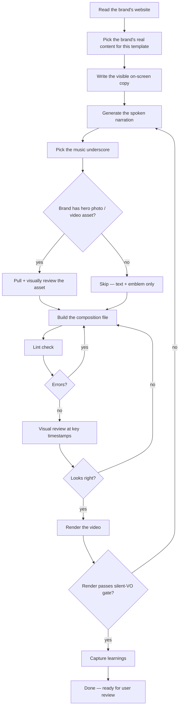

# Skill — Make a Cinematic Launch 60s video

A step-by-step recipe Claude Code follows to produce one 60-second vertical video in the cinematic-launch archetype. Each step says what Claude does, who does the work, and what comes out the other side.

---

## The flow at a glance

---

## What this video is for

A 60-second vertical video that **builds anticipation, names the thing, demonstrates with a real number, makes a promise, and closes with a call to act**. Atom emblem reveal at the wordmark moment; large gold counter on a real stat; replay-loop bridge at the close. Slow, ceremonial pace. Black-and-gold palette. Heavy-weight Georgia serif for the promise statements.

- Length: 60 seconds
- Shape: vertical, 1080×1920, 9:16
- Register: contemplative (premium / liturgical)
- Best for: product launches for premium contemplative brands, religious-tech reveals, luxury launches with a real number to anchor on, oracle-service openings
- Not for: SaaS feature ships, community brand launches, kinetic/energy product reveals, anything without a real stat to anchor the counter

---

## Before Claude starts

- A URL for the brand (or pasted brand copy if URL is behind a bot wall)
- A product/service name + sub-mark (e.g. wordmark "SINGULARITY" + sub-mark "CONVERGENCE")
- A real stat or number from the brand to drive the counter (e.g. years operating, members served, items processed) — never invented
- A canonical claim/proof line — a verse, founder quote, or first-principle that the brand actually uses
- A two-line promise the brand stands behind (one declarative line + one italic close)
- A CTA verb + URL

If the brand doesn't have a real stat to anchor the counter, this isn't the right skill — use Methodology 45s or Hook 15s instead.

---

## The steps

### Step 1 — Read the brand's website

**What Claude does:** Opens the brand's homepage in a real browser, waits for it to settle, and reads everything: headlines, paragraphs, colors, logo. Saves the raw findings so the next steps can use them.

**Who does the work:** the website reader.

**Output:** A record of the brand's actual words, palette, and asset URLs.

**Bot-wall guard:** if the brand's site returns a captcha page, Claude refuses to proceed and asks the user to paste the brand copy directly.

---

### Step 2 — Pick the brand's real content for this template

**What Claude does:** Reads the record from Step 1 and finds **three anticipation teasers** (fragmentary italic lines that build toward the reveal), the **wordmark + sub-mark** (the brand name and its qualifier), a **real number** the brand publishes (with a label like "VERSES PROCESSED" or "DAYS IN PRACTICE"), a **canonical claim line** (verse, founder quote, or principle in the brand's own voice), a **two-line promise** (one declarative, one italic close), and the **CTA + URL**. Uses the brand's exact wording. **Never invents** — if the brand doesn't publish a real stat, Claude stops and asks the user.

**Who does the work:** the file reader and the pattern finder.

**Output:** Three anticipation lines + wordmark + sub-mark + counter label + counter target number + counter suffix + verse/claim line + two-line promise + CTA verb + URL — all in the brand's voice.

---

### Step 3 — Write the visible on-screen copy

**What Claude does:** Drops the brand's words from Step 2 into the template's nine content slots. The three teasers (B1) are short and italic. The wordmark (B2) is the brand name in big roman caps with a wide-tracked sub-mark below. The counter label (B3) is small uppercase utility. The counter (B3) is the number itself. The verse (B3) is italic. The promise (B4) is heavy-weight roman for the first line, italic gold for the second. The CTA (B5) is gold tracked caps; the URL is sans-serif underneath.

**Who does the work:** the file writer.

**Output:** A list of slot-fills ready to drop into the template at Step 7.

---

### Step 4 — Generate the spoken narration

**What Claude does:** Writes a 110-word script that tracks the on-screen content but uses its own voicing — not a parrot of the visible text. Then turns the script into a real voice file (50–55 seconds long, fits cleanly inside the 60-second timeline before the afterglow loop bridge). The voice for this register is the cinematic American slow voice with weighted pitch, or the cinematic British equivalent for brands that read more European.

**Who does the work:** the file writer for the script, then the voice maker for the audio.

**Output:** A spoken narration audio file plus a captions file with word-level timing.

---

### Step 5 — Pick the music underscore

**What Claude does:** Picks a track from the contemplative shortlist (ambient cinematic piano, low drone, sparse harp). The pre-curated list lives in the project; Claude picks the one whose mood matches the brand. Music plays under the narration at low volume so the voice stays clear, with a 1.5-second fade-out across the afterglow scene so it doesn't cut mid-phrase.

**Who does the work:** the file reader for the shortlist, then the asset fetcher if a download is needed.

**Output:** A music file path that the template's audio tag points at.

---

### Step 6 — Pull a hero asset (optional)

**What Claude does:** The Cinematic Launch template doesn't strictly require a photo — the atom emblem at B2 and the counter at B3 are the visual heroes. But if the brand has a deep-cosmos / abstract / candlelit image on its homepage that suits the contemplative register, that can lift the cold open (B0). **Visual review is mandatory** — Claude opens the image and confirms it actually fits the brand's vibe before using it. Filenames lie.

**Who does the work:** the asset fetcher, then the image viewer.

**Output:** An asset file — only used if it survives the visual-review gate.

---

### Step 7 — Build the composition file

**What Claude does:** Copies the Cinematic Launch 60s template, replaces the content slots with the brand's words from Steps 2–4, swaps in the brand wordmark + sub-mark, replaces the counter target with the real number, points the audio tags at the files from Steps 4 and 5. Adds the persistent ambient brand emblem at the top-right corner (B3 stage occupies the rest of the frame, so top-right is the anchor).

**Who does the work:** the file reader for the template, the file writer for the new copy, the file editor for slot-by-slot replacement.

**Output:** A new composition file ready to render.

---

### Step 8 — Lint check + visual review before render

**What Claude does:** Runs the project's lint check first to catch any structural mistakes (zero errors required, warnings are fine). Then captures still frames at the seven key moments — flame opener (3s), anticipation teasers settled (11s), wordmark + atom revealed (17s), wordmark hold (21s), counter mid-animation (27s), verse settled (32s), first promise line (40s), italic close (46s), CTA hold (52s), afterglow flame (58s) — and looks at each one. Looking specifically for: text fitting on screen without breaking words, atom emblem rendering correctly, counter actually animating to the target number (not stuck at 0), brand emblem visible at the corner, type readable against the background.

This is the most important step. If it looks wrong here, the render will look wrong too.

**Who does the work:** the linter, the frame capturer, then the image viewer.

**Output:** A folder of still frames + a verdict in plain English: ship, watch, or iterate.

---

### Step 9 — Render the video

**What Claude does:** Stages the composition as the project's root index file, runs the renderer, waits for it to finish. The render gate refuses to start if the narration is still the silent placeholder — protects against shipping a silent video.

Render takes about 5-6 minutes for a 60-second contemplative composition (1800 frames at 30fps, 6 worker browsers in parallel).

**Who does the work:** the renderer, with the background watcher armed for completion notification.

**Output:** A finished MP4 video plus an auto-graded version.

---

### Step 10 — Capture what was learned

**What Claude does:** Adds an entry to the project's learnings log — what worked first try, what surprised, what took multiple iterations. Captures any new pattern that should propagate to the next render. Promotes pitfalls into the canonical pitfalls section so the next session sees them immediately.

**Who does the work:** the file reader on the learnings log, then the file editor to append the new entry.

**Output:** Updated learnings log and (if a register-level rule emerged) updated canonical patterns reference.

---

## How Claude knows the video is done

- Lint passes with zero errors (warnings are fine if they were already there before this build)
- Frame review at every key moment shows clean layout, atom emblem rendering, counter animating to the real target, brand emblem present, text fits
- Real narration is wired (silent-VO render gate is satisfied)
- The brand wordmark + CTA + URL appear at the close (not just at the very last frame)
- The promise lines come from brand canon, not invented copy
- The counter target is a real number the brand publishes — never made up
- The afterglow flame at the end matches the opener flame for clean replay-loop
- The user reviews the render and says ship — final gate is always the user's eye

---

## What Claude refuses to do

- Render with the silent placeholder narration
- Invent the counter number, outcome lines, promise statements, or claim/verse lines — only the brand's own words and real stats
- Skip the visual review before rendering
- Render twice without capturing learnings between
- Ship a render where the counter visually stays at 0 (the helper expects the target as the element's text content; a stuck counter is a wiring bug)

---

## When this skill takes longer than expected

Common reasons:
- Brand site is behind a bot wall — Step 1 fails, Claude asks for pasted copy
- The brand doesn't have a real stat to anchor the counter — wrong template, switch to Methodology or Hook
- Counter stays at 0 after render — the template expects the target number as the element's text content; check the wiring at Step 7
- Render fails at a late frame — usually a memory issue, kill leftover browser processes and retry
- Voice sounds wrong — try a different voice from the contemplative-register voice library or adjust pace
- Music cuts mid-phrase at the end — the fade-out tween at the afterglow scene needs to be wired

---

## Related skills

- `make-hook-15s.md` — for a single piercing question (scroll-stopper)
- `make-testimonial-30s.md` — for a testimonial / pull-quote
- `make-methodology-45s.md` — for a 3-step methodology
- `_template-make-video.md` — the master template every skill is filled in from

Each skill follows the same 10-step shape; only the content slots, the timing, and the asset requirements differ.

---

## Glossary — what the worker names mean

| Worker name in this doc | What it actually does in Claude Code |
|---|---|
| the website reader | Loads a URL in a headless browser and extracts text + colors + assets |
| the file reader | Opens a file and reads its contents |
| the file writer | Creates a new file with given contents |
| the file editor | Makes targeted edits to an existing file |
| the pattern finder | Searches across files for a pattern or string |
| the voice maker | Generates a TTS voice file from a text script |
| the asset fetcher | Downloads a photo, video, or music file from a stock source |
| the image viewer | Opens an image and lets Claude see it for visual judgment |
| the linter | Runs the project's static checks against the composition |
| the frame capturer | Renders still frames at specified seconds for review |
| the renderer | Captures every frame and encodes the final MP4 |
| the background watcher | Streams events from a long-running process so Claude can keep working |
