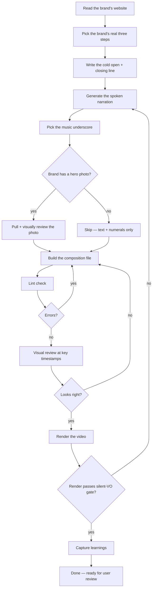

# Skill — Make a Methodology 45s video

A step-by-step recipe Claude Code follows to produce one 45-second vertical video in the methodology archetype. Each step says what Claude does, what does the work, and what comes out the other side.

---

## The flow at a glance

---

## What this video is for

A 45-second vertical video that walks through a **three-step methodology** for a brand that sells contemplation, depth, or revelation. Roman numerals (I., II., III.) anchor each step. Slow, ceremonial pace. Black-and-gold palette. Georgia serif type.

- Length: 45 seconds
- Shape: vertical, 1080×1920, 9:16
- Register: contemplative (premium / liturgical)
- Best for: meditation apps, oracle services, luxury watches, perfume launches, religious-tech, methodology-driven services
- Not for: SaaS feature launches, community apps, food / fitness, anything requiring a high-energy hook

---

## Before Claude starts

- A URL for the brand (or pasted brand copy if URL is behind a bot wall)
- A clear three-step process or three-pillar pattern in the brand's offer
- The brand's wordmark and a CTA verb (e.g. "ASK THE ORACLE", "BEGIN THE PRACTICE")

If the brand doesn't have a three-step structure, this isn't the right skill — use Hook 15s or Testimonial 30s instead.

---

## The steps

### Step 1 — Read the brand's website

**What Claude does:** Opens the brand's homepage in a real browser, waits for it to settle, and reads everything: headlines, paragraphs, colors, logo. Saves the raw findings so the next steps can use them.

**Who does the work:** the website reader.

**Output:** A record of the brand's actual words, palette, and asset URLs.

**Bot-wall guard:** if the brand's site returns a captcha page, Claude refuses to proceed and asks the user to paste the brand copy directly.

---

### Step 2 — Pick the brand's real three steps

**What Claude does:** Reads the record from Step 1 and finds the brand's own three-step process (or three pillars). Uses the brand's exact wording for the headlines. Writes a one-sentence body line for each step in the same voice. **Never invents** — if the brand doesn't have three obvious steps, Claude stops and asks the user.

**Who does the work:** the file reader and the pattern finder.

**Output:** Three step headlines + three body lines + one closing line, all in the brand's voice.

---

### Step 3 — Write the cold open and the closing line

**What Claude does:** Writes one italic opening line (the cold open / promise — like "There are three doors. Only one of them opens.") and one short closing line. Both come from the brand's tone. The closing line uses the brand's own words, never made up.

**Who does the work:** the file writer.

**Output:** Cold-open line + closing line, ready to drop into the template's content slots.

---

### Step 4 — Generate the spoken narration

**What Claude does:** Writes a 75-word script that tracks the on-screen content but uses its own voicing — not a parrot of the visible text. Then turns the script into a real voice file (35–40 seconds long, fits cleanly inside the 45-second timeline before the CTA). The voice convention for the contemplative register is the cinematic American voice with a slow, weighted pace.

**Who does the work:** the file writer for the script, then the voice maker for the audio.

**Output:** A spoken narration audio file plus a captions file with word-level timing.

---

### Step 5 — Pick the music underscore

**What Claude does:** Picks a track from the contemplative shortlist (ambient cinematic piano, low drone, sparse harp). The pre-curated list lives in the project; Claude picks the one whose mood matches the brand. Music plays under the narration at low volume so the voice stays clear.

**Who does the work:** the file reader for the shortlist, then the asset fetcher if a download is needed.

**Output:** A music file path that the template's audio tag points at.

---

### Step 6 — Pull a portrait or atmospheric photo (optional)

**What Claude does:** If the brand has a hero photo on its homepage, downloads it. Otherwise picks a contemplative stock photo (a hand holding a book, a lit candle, an empty cathedral). **Visual review is mandatory** — Claude opens the image and confirms it actually fits the brand's vibe before using it. Filenames lie.

The Methodology template doesn't strictly require a photo (it's text-and-numerals first), but a small atmospheric backdrop can lift it.

**Who does the work:** the asset fetcher, then the image viewer.

**Output:** A photo file — only used if it survives the visual-review gate.

---

### Step 7 — Build the composition file

**What Claude does:** Copies the Methodology 45s template, replaces the content slots with the brand's words from Steps 2–4, swaps in the brand wordmark and CTA, points the audio tags at the files from Steps 4 and 5. Adds the persistent ambient brand emblem at the bottom-left corner.

**Who does the work:** the file reader for the template, the file writer for the new copy, the file editor for slot-by-slot replacement.

**Output:** A new composition file ready to render.

---

### Step 8 — Lint check + visual review before render

**What Claude does:** Runs the project's lint check first to catch any structural mistakes (zero errors required, warnings are fine). Then captures still frames at key moments — cold open, mid-first-step, mid-third-step, closing line, CTA — and looks at each one. Looking specifically for: text fitting on screen without breaking words, brand emblem visible at the corner, type readable against the background.

This is the most important step. If it looks wrong here, the render will look wrong too.

**Who does the work:** the linter, the frame capturer, then the image viewer.

**Output:** A folder of still frames + a verdict in plain English: ship, watch, or iterate.

---

### Step 9 — Render the video

**What Claude does:** Stages the composition as the project's root index file, runs the renderer, waits for it to finish. The render gate refuses to start if the narration is still the silent placeholder — protects against shipping a silent video.

Render takes about 4 minutes for a 45-second contemplative composition.

**Who does the work:** the renderer, with the background watcher armed for completion notification.

**Output:** A finished MP4 video plus an auto-graded version.

---

### Step 10 — Capture what was learned

**What Claude does:** Adds an entry to the project's learnings log — what worked first try, what surprised, what took multiple iterations. Captures any new pattern that should propagate to the next render. Promotes pitfalls into the canonical pitfalls section so the next session sees them immediately.

**Who does the work:** the file reader on the learnings log, then the file editor to append the new entry.

**Output:** Updated learnings log and (if a register-level rule emerged) updated canonical patterns reference.

---

## How Claude knows the video is done

- Lint passes with zero errors (warnings are fine if they were already there before this build)
- Frame review at every key moment shows clean layout, brand emblem present, text fits
- Real narration is wired (silent-VO render gate is satisfied)
- The brand wordmark + CTA + URL appear at the close (not just at the very last frame)
- The closing line comes from brand canon, not invented copy
- The user reviews the render and says ship — final gate is always the user's eye

---

## What Claude refuses to do

- Render with the silent placeholder narration (contemplative-register Rule S15)
- Invent outcome lines, stats, or aphorisms — only the brand's own words (Rule S14)
- Skip the visual review before rendering (silent loop is non-negotiable)
- Render twice without capturing learnings between (sequential improvement rule)

---

## When this skill takes longer than expected

Common reasons:
- Brand site is behind a bot wall — Step 1 fails, Claude asks for pasted copy
- The brand doesn't have a clear three-step structure — wrong template, switch to Hook or Testimonial
- Render fails at a late frame — usually a memory issue, kill leftover browser processes and retry
- Voice sounds wrong — try a different voice from the contemplative-register voice library or adjust pace

---

## Related skills

- `make-hook-15s.md` — for a single piercing question (scroll-stopper)
- `make-testimonial-30s.md` — for a testimonial / pull-quote
- `make-cinematic-launch-60s.md` — for a cinematic launch trailer
- `make-singularity-convergence-60s.md` — the reference build (10-beat manifesto)

Each skill follows the same 10-step shape; only the content slots and the timing differ.

---

## Glossary — what the worker names mean

| Worker name in this doc | What it actually does in Claude Code |
|---|---|
| the website reader | Loads a URL in a headless browser and extracts text + colors + assets |
| the file reader | Opens a file and reads its contents |
| the file writer | Creates a new file with given contents |
| the file editor | Makes targeted edits to an existing file |
| the pattern finder | Searches across files for a pattern or string |
| the voice maker | Generates a TTS voice file from a text script |
| the asset fetcher | Downloads a photo or music file from a stock source |
| the image viewer | Opens an image and lets Claude see it for visual judgment |
| the linter | Runs the project's static checks against the composition |
| the frame capturer | Renders still frames at specified seconds for review |
| the renderer | Captures every frame and encodes the final MP4 |
| the background watcher | Streams events from a long-running process so Claude can keep working |
